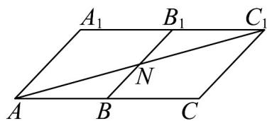

> [!faq]- 《专题01_空间向量及其运算高频题型精准突破_八大题型__高效培优期末专》官方解析
>
> > [!success]- **【答案】** ACD
>
> > [!note]- **【分析】**
> > 首先设 $a = AB, b = AD, c = AA_{1}$ ，得到 $\left|a\right| = \left|b\right| = \left|c\right| = 1$ ， $a, b, c$ 的夹角为 $60^{\circ}$ 。
> >
> > 对选项 A，根据 $BD_{1} = -a + c + b$ ，再平方即可判断 A 正确，对选项 B，根据 $A_{1}E \cdot BD = 0$ 即可判断 B 错误，对选项 C，根据 $B_{1}D_{1} \perp A_{1}C_{1}$ ， $A_{1}E \perp B_{1}D_{1}$ 即可判断 C 正确，对选项 D，根据当且仅当 A, N, $C_{1}$ 三点共线时， $AN + NC_{1}$ 有最小值，即可判断 D 正确。
>
> > [!note]- **【解析】**
> > 设 $a = AB, b = AD, c = AA_1$ ，则 $\left|a\right| = \left|b\right| = \left|c\right| = 1$ ， $a, b, c$ 的夹角为 $60^\circ$ .
> >
> > 对选项 A， $BD_{1}=\overline{BA}+\overline{AA}_{1}+\overline{A_{1}}D_{1}=-a+c+b$
> >
> > $BD_{1}^{2}=a^{2}+b^{2}+c^{2}-2a\cdot c-2a\cdot b+2b\cdot c=2$ ，则 $BD_{1}=\sqrt{2}$ ，故 $^{A}$ 正确·
> >
> > 对选项 B， $A_{1}E = A_{1}D_{1} + D_{1}C_{1} + C_{1}E = b + a - \frac{1}{2}c$ ，BD = b - a，
> >
> > $$
> > A _ {1} E \cdot B D = \left(b + a - \frac {1}{2} c\right) \cdot (b - a) = b ^ {2} + a \cdot b - \frac {1}{2} b \cdot c - a \cdot b - a ^ {2} + \frac {1}{2} a \cdot c = 0
> > $$
> >
> > 所以 $A_{1}E \perp BD$ ，故 B 错误.
> >
> > 对选项 C，因为四边形 $A_{1}B_{1}C_{1}D_{1}$ 为菱形，所以 $B_{1}D_{1} \perp A_{1}C_{1}$
> >
> > 又因为 $A_{1}E \perp BD$ ， $B_{1}D_{1}//BD$ ，所以 $A_{1}E \perp B_{1}D_{1}$ .
> >
> > 因为 $A_{1}C_{1}\subset$ 平面 $ACC_{1}A_{1}$ ， $A_{1}E\subset$ 平面 $ACC_{1}A_{1}$ ， $A_{1}C_{1}\cap A_{1}E = A_{1}$
> >
> > 所以 $B_{1}D_{1} \perp$ 平面 $ACC_{1}A_{1}$ ，故 C 正确.
> >
> > 对选项D，如图所示：
> >
> > 
> >
> > 当且仅当 $A, N, C_{1}$ 三点共线时， $AN + NC_{1}$ 有最小值·
> >
> > $$
> > A C = 2, C C _ {1} = 1, \angle A C C _ {1} = 1 2 0 ^ {\circ}
> > $$
> >
> > 所以 $\left(AN + NC_{1}\right)_{\min} = \sqrt{2^{2} + 1^{2} - 2 \times 2 \times 1 \times \left(-\frac{1}{2}\right)} = \sqrt{7}$ ，故D正确.
> >
> > 故选 **ACD**
