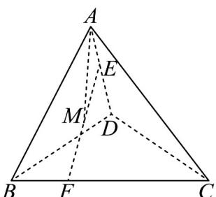
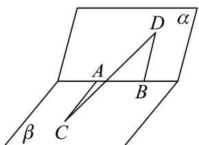

> [!faq]- 《专题01_空间向量及其运算高频题型精准突破_八大题型__高效培优期末专》官方解析
>
> > [!success]- **【答案】** ABD
>
> > [!note]- **【分析】**
> > 选 $AB, AC, AD$ 为空间内的基底向量，利用向量的线性运算，可得 $EF = -\lambda AD + (1 - \mu) AB + \mu AC$ 即可由模长公式，结合不等式即可判断A；根据数量积的运算即可判断B；根据模长可得 $EF^2 = 4[(\lambda + \mu)^2 - 2\lambda \mu] - 4(\lambda + \mu) + 4 = 3$ ，即可由不等式以及一元二次不等式判断C； $|AM|^2 = \lambda^2 + \mu^2 + \lambda - \mu + 1$ ，结合 $EF^2 = 4(\lambda^2 + \mu^2) - 4(\lambda + \mu) + 4 = 3$ ，可求 $AM^2$ 的范围，可判断D.【详解】由正四面体 $A - BCD$ ，可知 $\angle BAC = \angle BAD = \angle CAD = 60^\circ$ ，选 $AB, AC, AD$ 为空间内的基底向量， $AD \cdot AB = AB \cdot AC = AD \cdot AC = 2 \times 2 \times \frac{1}{2} = 2$
> >
> > 
> >
> > 因为 $EF = EA + AB + BF = -\lambda AD + AB + \mu (AC - AB) = -\lambda AD + (1 - \mu)AB + \mu AC$ ，故 $EF^2 = \left[-\lambda AD + (1 - \mu)AB + \mu AC\right]^2$ $= \lambda^2 AD^2 + (1 - \mu)^2 AB^2 + \mu^2 AC - 2\lambda (1 - \mu)AD \cdot AB + 2\mu (1 - \mu)AB \cdot AC - 2\lambda \mu AD \cdot AC$ $= 4\lambda^2 + 4(1 - \mu)^2 + 4\mu^2 - 4\lambda (1 - \mu) + 4\mu (1 - \mu) - 4\mu\lambda$
> >
> > $= 4\lambda^{2} + 4\mu^{2} - 4(\lambda + \mu) + 4 = 4[(\lambda + \mu)^{2} - 2\lambda \mu] - 4(\lambda + \mu) + 4$ $4(\lambda + \mu)^{2} - 4(\lambda + \mu) + 4 - 8 \times \frac{(\lambda + \mu)^{2}}{4}$ $= 2(\lambda + \mu)^{2} - 4(\lambda + \mu) + 4 = 2[(\lambda + \mu) - 1]^{2} + 2$ ，当 $\lambda + \mu = 1$ 时，取到等号，故 $|EF| \sqrt{2}$ ，故A正确；
> > 当 $\lambda = \frac{1}{2}$ ， $EF = -\frac{1}{2} AD + (1 - \mu)AB + \mu AC$
> >
> > 所以
> >
> > $EF \cdot AD = \left[-\frac{1}{2}AD + (1 - \mu)AB + \mu AC\right] \cdot AD = -\frac{1}{2}AD \cdot AD + (1 - \mu)AB \cdot AD + \mu AC \cdot AD = -\frac{1}{2} \times 4 + 2(1 - \mu) + 2\mu = 0$ 故 $^B$ 正确，
> >
> > 当 $\left|EF\right| = \sqrt{3}$ 时， $EF^2 = 4[(\lambda + \mu)^2 - 2\lambda\mu] - 4(\lambda + \mu) + 4 = 3$ ，可得 $4(\lambda + \mu)^2 - 4(\lambda + \mu) + 1 = 8\lambda\mu \leq 8\left(\frac{\lambda + \mu}{2}\right)^2 \Rightarrow 2(\lambda + \mu)^2 - 4(\lambda + \mu) + 1 \leq 0$ ，解得 $1 - \frac{\sqrt{2}}{2} \leq \lambda + \mu \leq 1 + \frac{\sqrt{2}}{2}$ ，故当
> >
> > 且仅当 $\lambda = \mu$ 时， $\lambda + \mu$ 取最小值为 $1 - \frac{\sqrt{2}}{2}$ ，故 $^C$ 错误， $AM = AE + EM = AE + \frac{1}{2}EF = \lambda AD + \frac{1}{2}\left(-\lambda AD + (1 - \mu)AB + \mu AC\right)$ $= \frac{1}{2}\left[\lambda AD + (1 - \mu)AB + \mu AC\right]$ 所以 $\left|AM\right|^2 = \frac{1}{4}[\lambda AD + (1 - \mu)AB + \mu AC]^2 = \frac{1}{4}[4\lambda^2 + 4(1 - \mu)^2 + 4\mu^2 + 4\lambda(1 - \mu) + 4\mu(1 - \mu) + 4\mu\lambda]$ $= \lambda^2 + \mu^2 + \lambda - \mu + 1$ 由于当 $\left|EF\right| = \sqrt{3}$ ，故 $EF^2 = 4(\lambda^2 + \mu^2) - 4(\lambda + \mu) + 4 = 3$ 因此 $\left|AM\right|^2 = \frac{-1 + 4(\lambda + \mu)}{4} + \lambda - \mu + 1 = 2\lambda + \frac{3}{4}$ 由于 $_0 ≤ \lambda ≤ 1$ ，故 $\left|AM\right|^2 = 2\lambda + \frac{3}{4} \in [\frac{3}{4}, \frac{11}{4}]$ ，因此 $|AM| \in [\frac{\sqrt{3}}{2}, \frac{\sqrt{11}}{2}]$ ，故 $^D$ 正确，
> >
> > 故选：ABD.
> >
> > 63. 二面角的棱上有 $A$ 、 $B$ 两点，直线 $AC$ 、 $BD$ 分别在这个二面角的两个半平面内，且都垂直于 $AB$ ，已知 $AB = 2, AC = 3, BD = 4, CD = 6$ ，则该二面角的余弦值为（）
> >
> > 
> >
> > A. $\frac{3}{10}$ B. $-\frac{3}{10}$ C. $\frac{7}{24}$ D. $-\frac{7}{24}$
> >
> > 【答案】D
> >
> > 【分析】由 $CD = CA + AB + BD$ ，应用向量数量积的运算律及已知可得 $AC \cdot BD = -\frac{7}{2}$ ，即可求二面角余弦值。
>
> > [!note]- **【解析】**
> > 由 $CD = CA + AB + BD$ ，且 $AC \perp AB, BD \perp AB$ ，
> >
> > 得 $CD^{2}=(CA+AB+BD)^{2}=CA^{2}+AB^{2}+BD^{2}+2CA\cdot AB+2AB\cdot BD+2CA\cdot BD$
> >
> > 故 $36 = 9 + 4 + 16 + 0 + 0 + 2CA \cdot BD \Rightarrow CA \cdot BD = \frac{7}{2}$ ，即 $AC \cdot BD = -\frac{7}{2}$
> >
> > 所以 $\cos\left\langle AC, BD\right\rangle = \frac{\overrightarrow{AC} \cdot \overrightarrow{BD}}{|AC||BD|} = \frac{-\frac{7}{2}}{3 \times 4} = -\frac{7}{24}$ ，即二面角的余弦值为 $-\frac{7}{24} \cdot$
> >
> > 故选 **D**
