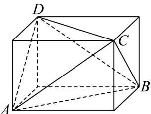

> [!faq]- 《专题01_空间向量及其运算高频题型精准突破_八大题型__高效培优期末专》官方解析
>
> > [!success]- **【答案】** ACD
>
> > [!note]- **【分析】**
> > 依题意要证 $AB \perp CD$ ，即证 $AB \cdot CD = a \cdot c - a \cdot b = 0$ ，结合数量积的运算律判断 A、C、D，将四面
> >
> > 体放入长方体中，即可判断 B.
>
> > [!note]- **【解析】**
> > 因为 $CD = AD - AC = c - b$
> >
> > 要证 $AB \perp CD$ ，即证 $AB \cdot CD = a \cdot (c - b) = a \cdot c - a \cdot b = 0$ .
> >
> > 对 A 选项：由 $a \cdot b = a \cdot c$ ，则 $a \cdot c - a \cdot b = 0$ ，所以 $AB \perp CD$ 成立，故 A 正确。
> >
> > 对 $^{B}$ 选项：将四面体ABCD放入长方体中，使 $\left|AB\right|$ 与 $\left|CD\right|$ ， $\left|AC\right|$ 与 $\left|BD\right|$ ， $\left|AD\right|$ 与 $\left|BC\right|$ 分别为相对面的对角线长，
> >
> > 
> >
> > 显然 AB 与 CD 不一定垂直，如图长方体的底面不为正方形时 AB 与 CD 不垂直，故 B 错误.
> >
> > 对 C 选项：因为 $\left|\overline{A}C\right|=\left|\overline{B}C\right|$ ， $\left|\overline{A}D\right|=\left|\overline{B}D\right|$
> >
> > 即 $\left|b\right|=\left|a-b\right|$ 和 $\left|c\right|=\left|a-c\right|$ ，平方得 $b^{2}=a^{2}-2a\cdot b+b^{2}$ ， $c^{2}=a^{2}-2a\cdot c+c^{2}$ ，
> >
> > 即 $\left|a\right|^{2}=2a\cdot b$ 和 $\left|a\right|^{2}=2a\cdot c$
> >
> > 所以 $a \cdot b = a \cdot c$ ，所以 $AB \cdot CD = a \cdot (c - b) = a \cdot c - a \cdot b = 0$
> >
> > 即 $AB \perp CD$ ，故 C 正确.
> >
> > 对 D 选项：由 $AC \cdot BD = 0$ 得 $AC \cdot AD - AC \cdot AB = 0$ ，即 $b \cdot c = a \cdot b$ ①，
> >
> > 由 $AD \cdot BC = 0$ 得 $AD \cdot AC - AD \cdot AB = 0$ ，即 $b \cdot c = a \cdot c$ ②，
> >
> > 由①②得 $a \cdot b = a \cdot c$ ，所以 $AB \cdot CD = a \cdot c - a \cdot b = 0$ ，即 $AB \perp CD$ ，故D正确·
> >
> > 故选 **ACD**
