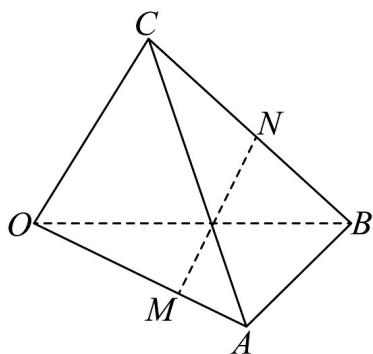

<!-- question-source:start -->
16. 如图，在空间四边形 $OABC$ 中， $\overline{OA} = a$ ， $\overline{OB} = b$ ， $\overline{OC} = c$ ，且 $OM = 2MA$ ， $BN = NC$ ，则 $\overline{MN}$ 等于（）

A. $-\frac{2}{3}a + \frac{1}{2}b + \frac{1}{2}c$

B. $\frac{1}{2} a + \frac{1}{2} b - \frac{1}{2} c$

C. $\frac{2}{3} a + \frac{2}{3} b + \frac{1}{2} c$

D. $\frac{1}{2} a - \frac{2}{3} b + \frac{1}{2} c$
<!-- question-source:end -->

![[高中/课堂同步/题库/人教A版高中数学同步讲义(2026)/04_选择性必修第二册/期末/专项训练/专题02_空间向量基本定理高频题型精准突破_三大题型__高效培优期末专/_compact/answers/Q00060532A1.md]]
