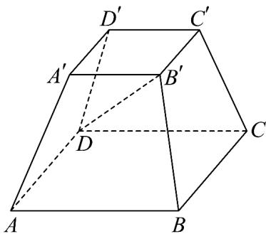

<!-- question-source:start -->
19. 如图，在四棱台 $ABCD - A'B'C'D'$ 中， $\angle BAD = \angle BAA' = \angle DAA' = 60^\circ$ ， $AA' = 12$ ，设 $m = \left|DB' - (\lambda AB + \mu AD)\right|(\lambda, \mu \in \mathbf{R})$ ，则 $m$ 的最小值为 \_\_\_\_.

<!-- question-source:end -->

![[高中/课堂同步/题库/人教A版高中数学同步讲义(2026)/04_选择性必修第二册/期末/专项训练/专题02_空间向量基本定理高频题型精准突破_三大题型__高效培优期末专/_compact/answers/Q00060534A1.md]]
