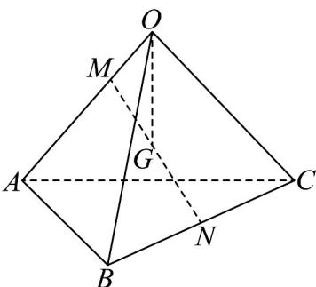

<!-- question-source:start -->
20. 如图，三棱锥 $O - ABC$ 中， $M$ 为线段 $OA$ 上靠近 $O$ 的三等分点， $\overrightarrow{MN} = \frac{\overrightarrow{MB} + \overrightarrow{MC}}{2}$ ，点 $G$ 为 $MN$ 的中点，记 $\overrightarrow{OA} = a, \overrightarrow{OB} = b, \overrightarrow{OC} = c$ ，则 $\overrightarrow{OG} = (\quad)$

A. $\frac{1}{4} a + \frac{1}{4} b + \frac{1}{6} c$ B. $\frac{1}{6} a + \frac{1}{4} b + \frac{1}{4} c$ C. $\frac{1}{6} a + \frac{1}{6} b + \frac{1}{4} c$ D. $\frac{1}{4} a + \frac{1}{6} b + \frac{1}{6} c$
<!-- question-source:end -->

![[高中/课堂同步/题库/人教A版高中数学同步讲义(2026)/04_选择性必修第二册/期末/专项训练/专题02_空间向量基本定理高频题型精准突破_三大题型__高效培优期末专/_compact/answers/Q00060535A1.md]]
