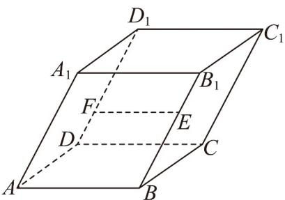

<!-- question-source:start -->
21. 如图，平行六面体 $ABCD - A_1B_1C_1D_1$ 的所有棱长均为 2， $\angle A_1AB = \angle A_1AD = \angle BAD = 60^\circ$ ，点 $E$ ， $F$ 分别在棱 $BB_1$ ， $DD_1$ 上，且 $BE = 2B_1E$ ， $D_1F = 2DF$ ，则（）

A. $A, E, C_1, F$ 四点共面 B. $AA_1$ 在 $AC_1$ 方向上的投影向量为 $\frac{1}{3} AC_1$ C. $\left|\overrightarrow{EF}\right| = \frac{\sqrt{10}}{3}$ D. 直线 $AC_1$ 与 $EF$ 所成角的余弦值为 $\frac{\sqrt{15}}{15}$
<!-- question-source:end -->

![[高中/课堂同步/题库/人教A版高中数学同步讲义(2026)/04_选择性必修第二册/期末/专项训练/专题02_空间向量基本定理高频题型精准突破_三大题型__高效培优期末专/_compact/answers/Q00060536A1.md]]
