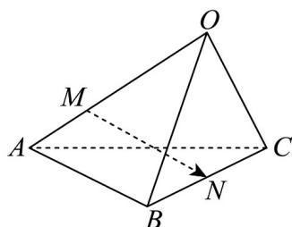

<!-- question-source:start -->
22. 如图所示，空间四边形 $OABC$ 中， $OA = a, OB = b, OC = c$ ，点 $M$ 在 $OA$ 上，且 $OM = 2MA$ ， $N$ 为 $BC$ 中点，则 $MN$ 等于（）

A. $\frac{1}{2} a - \frac{2}{3} b + \frac{1}{2} c$ B. $-\frac{2}{3} a + \frac{1}{2} b + \frac{1}{2} c$ C. $\frac{1}{2} a + \frac{1}{2} b - \frac{2}{3} c$ D. $\frac{2}{3} a + \frac{2}{3} b - \frac{1}{2} c$
<!-- question-source:end -->

![[高中/课堂同步/题库/人教A版高中数学同步讲义(2026)/04_选择性必修第二册/期末/专项训练/专题02_空间向量基本定理高频题型精准突破_三大题型__高效培优期末专/_compact/answers/Q00060537A1.md]]
