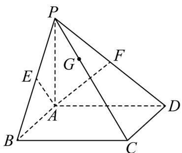

<!-- question-source:start -->
23. 如图，在四棱锥 $P - ABCD$ 中，底面 $ABCD$ 为平行四边形，点 $E, F$ 分别为 $PB, PD$ 的中点，若 $PG = \frac{1}{2} GC$ ，且 $AG = xAE + yAF$ ，则 $x + y = (\quad)$

A. 1 B. 2 C. $\frac{3}{2}$ D. $\frac{4}{3}$
<!-- question-source:end -->

![[高中/课堂同步/题库/人教A版高中数学同步讲义(2026)/04_选择性必修第二册/期末/专项训练/专题02_空间向量基本定理高频题型精准突破_三大题型__高效培优期末专/_compact/answers/Q00060538A1.md]]
