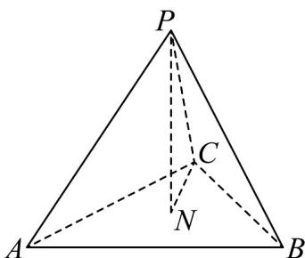

<!-- question-source:start -->
28. 如图，在边长为 $^{2}$ 的正四面体 $P-ABC$ 中，N 是 VABC 的中心，则下列正确的是（）

A. $PA \cdot BC = 4$ B. $PA \cdot AB = 2$ C. $PN = \frac{1}{3}PB + \frac{1}{3}BC + \frac{1}{3}BA$ D. $PN = \frac{1}{3}PB + \frac{1}{3}PC - \frac{1}{3}AP$
<!-- question-source:end -->

![[高中/课堂同步/题库/人教A版高中数学同步讲义(2026)/04_选择性必修第二册/期末/专项训练/专题02_空间向量基本定理高频题型精准突破_三大题型__高效培优期末专/_compact/answers/Q00060543A1.md]]
