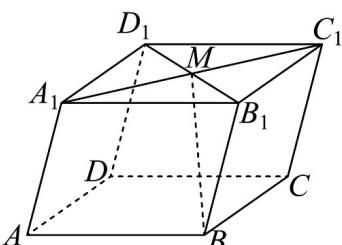

<!-- question-source:start -->
30．如图，在平行六面体 $ABCD-A_{1}B_{1}C_{1}D_{1}$ 中，M 为 $A_{1}C_{1}$ 与 $B_{1}D_{1}$ 的交点．若 $AB=a$ ， $AD=b$ ， $AA_{1}=c$ ，则下列向量中与 BM 相等的向量是（）

$$
- \frac {1}{2} a - \frac {1}{2} b + c
$$

$$
\frac {1}{2} a + \frac {1}{2} b + c
$$

$$
\frac {1}{2} a - \frac {1}{2} b + c
$$

$$
- \frac {1}{2} a + \frac {1}{2} b + c
$$
<!-- question-source:end -->

![[高中/课堂同步/题库/人教A版高中数学同步讲义(2026)/04_选择性必修第二册/期末/专项训练/专题02_空间向量基本定理高频题型精准突破_三大题型__高效培优期末专/_compact/answers/Q00060545A1.md]]
