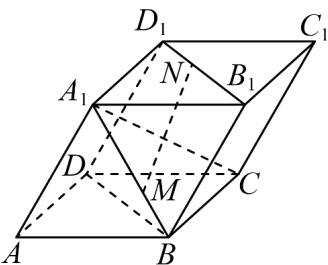

<!-- question-source:start -->
32. 在平行六面体 $ABCD - A_{1}B_{1}C_{1}D_{1}$ 中， $M, N$ 分别是线段 $A_{1}B$ ， $B_{1}D_{1}$ 上的点，且 $A_{1}M = 2MB$ ， $B_{1}N = 2ND_{1}$ 若 $A_{1}B_{1} = A_{1}D_{1} = AA_{1} = 1$ ， $\angle B_{1}A_{1}D_{1} = 90^{\circ}$ ， $\angle A_{1}AB = \angle A_{1}AD = 60^{\circ}$ ，则下列说法中正确的是（）

A. $\frac{AB}{AB}$ 与 $B_{1}D_{1}$ 的夹角为 $45^{\circ}$ B. $MN = \frac{1}{3} AB + \frac{2}{3} AD + \frac{1}{3} AA_{1}$ C. 线段 $A_{1}C$ 的长度为 1

D. 直线 $A_{1}C$ 与 $BB_{1}$ 所成的角为 $60^{\circ}$
<!-- question-source:end -->

![[高中/课堂同步/题库/人教A版高中数学同步讲义(2026)/04_选择性必修第二册/期末/专项训练/专题02_空间向量基本定理高频题型精准突破_三大题型__高效培优期末专/_compact/answers/Q00060547A1.md]]
