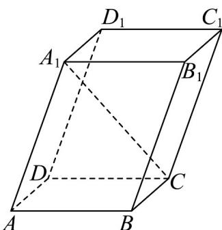

<!-- question-source:start -->
33. 如图，在棱长均为 $^{2}$ 的平行六面体 $ABCD-A_{1}B_{1}C_{1}D_{1}$ 中，底面ABCD是正方形，且 $\angle A_{1}AB=\angle A_{1}AD=60^{\circ}$ ，下列选项正确的是（）

A. $BD_{1}$ 长为 $2\sqrt{3}$

B. 异面直线 $AC$ 与 $BD_{1}$ 所成角的余弦值为 $\frac{\sqrt{6}}{3}$ C. $A_{1}C \perp B_{1}D_{1}$ D. $AA_{1} \perp BD$
<!-- question-source:end -->

![[高中/课堂同步/题库/人教A版高中数学同步讲义(2026)/04_选择性必修第二册/期末/专项训练/专题02_空间向量基本定理高频题型精准突破_三大题型__高效培优期末专/_compact/answers/Q00060548A1.md]]
