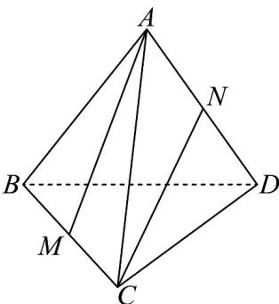

<!-- question-source:start -->
40．如图，在棱长为1的正四面体（四个面都是正三角形）ABCD中，M，N分别为BC，AD的中点，且MA在CN方向上的投影向量为 $\mu CN$ ，则 $\mu$ 的值为（）

A. $\frac{2}{3}$ B. $\frac{1}{3}$ C. $\frac{2}{5}$ D. $\frac{1}{4}$
<!-- question-source:end -->

![[高中/课堂同步/题库/人教A版高中数学同步讲义(2026)/04_选择性必修第二册/期末/专项训练/专题02_空间向量基本定理高频题型精准突破_三大题型__高效培优期末专/_compact/answers/Q00060554A1.md]]
