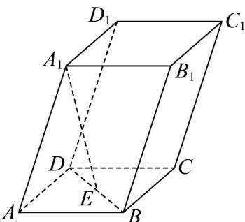

<!-- question-source:start -->
44. 如图，在四棱柱 $ABCD - A_1B_1C_1D_1$ 中，底面 $ABCD$ 是平行四边形，点 $E$ 为 $BD$ 的中点，若 $A_1E = xAA_1 + yAB + zAD$ ，则 $x + y + z =$ \_\_\_\_.

<!-- question-source:end -->

![[高中/课堂同步/题库/人教A版高中数学同步讲义(2026)/04_选择性必修第二册/期末/专项训练/专题02_空间向量基本定理高频题型精准突破_三大题型__高效培优期末专/_compact/answers/Q00060555A1.md]]
