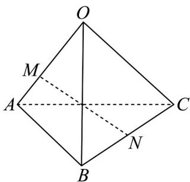

> [!faq]- 《专题02_空间向量基本定理高频题型精准突破_三大题型__高效培优期末专》官方解析
>
> > [!success]- **【答案】** A
>
> > [!note]- **【分析】**
> > 利用空间向量加减运算与数乘运算的几何表示即可得解·
>
> > [!note]- **【解析】**
> > 根据题意，
> >
> > $$
> > \begin{array}{l} \square \square \square \\ M N = M A + A N = M A + A B + \frac {1}{2} B C = \frac {1}{3} O A + (O B - O A) + \frac {1}{2} (O C - O B) \end{array}
> > $$
> >
> > $$
> > = - \frac {2}{3} O A + \frac {1}{2} O B + \frac {1}{2} O C = - \frac {2}{3} a + \frac {1}{2} b + \frac {1}{2} c.
> > $$
> >
> > 故选：A
> >
> > 17. 空间四边形 $OABC$ 中， $\overline{OA} = a$ ， $\overline{OB} = b$ ， $\overline{OC} = c$ ，点 $M$ 在 $OA$ 上， $\overline{OM} = \frac{2}{3} \overline{OA}$ ，点 $N$ 为 $BC$ 的中点，
> >
> > 则 $MN = (\quad)$
> >
> > 
> >
> > A. $\frac{1}{2} a - \frac{2}{3} b + \frac{1}{2} c$
> >
> > B. $-\frac{2}{3}a + \frac{1}{2}b + \frac{1}{2}c$
> >
> > C. $\frac{1}{2} a + \frac{1}{2} b - \frac{1}{2} c$
> >
> > D. $\frac{2}{3} a + \frac{2}{3} b - \frac{1}{2} c$
> >
> > 【答案】B
> >
> > 【分析】根据空间向量线性运算法则计算可得·
> >
> > 【详解】依题意可得 $\overline{MN}=\overline{ON}-\overline{OM}=\frac{1}{2}\left(\overline{OB}+\overline{OC}\right)-\frac{2}{3}\overline{OA}$
> >
> > $$
> > = \frac {1}{2} O B + \frac {1}{2} O C - \frac {2}{3} O A = - \frac {2}{3} a + \frac {1}{2} b + \frac {1}{2} c
> > $$
> >
> > 故选 **B**
