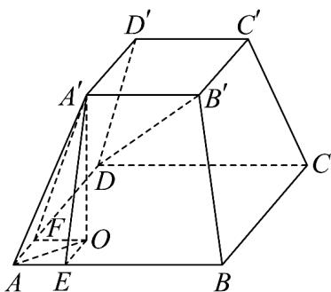

> [!faq]- 《专题02_空间向量基本定理高频题型精准突破_三大题型__高效培优期末专》官方解析
>
> > [!success]- **【答案】** $4 \sqrt{6}$
>
> > [!note]- **【分析】**
> > 令 $\overline{DE}=\lambda\overline{DC}+(-\mu)\overline{DA}$ ， $E\in$ 面ABCD，得到 $m=\left|\overline{EB'}\right|$ ，从而将问题转化成求四棱台的高，再根据题设条件，即可解决问题·
>
> > [!note]- **【解析】**
> > 如图，因为 $\lambda AB + \mu AD = \lambda DC + (-\mu)DA$ ，令 $DE = \lambda DC + (-\mu)DA$ ，则 $E \in$ 面 ABCD，则 $m = \left|DB' - (\lambda AB + \mu AD)\right| = \left|DB' - DE\right| = \left|EB'\right|$ ，所以 m 的最小值即为四棱台的高，过 $A'$ 作 $A'O \perp$ 面 ABCD 于 O，过 O 作 $OE \perp AB$ 于 E，过 O 作 $OF \perp AD$ 于 F，连接 OA, OE, OF, $OA'$ ，
> > 因为 $A'O \perp$ 平面 ABCD， $AB \subset$ 平面 ABCD，所以 $A'O \perp AB$ ，
> > 又 $OE \perp AB$ ， $OE \cap OA' = O$ ， $OE, OA' \subset$ 平面 $EOA'$ ，所以 $AE \perp$ 平面 $EOA'$ ，所以 $AE \perp EA'$ ，
> > 又 $\angle BAD = \angle BAA' = \angle DAA' = 60^\circ$ ， $AA' = 12$ ，得到 $EA' = 6\sqrt{3}$ ，AE = 6，
> > 同理可得， $AF \perp FA'$ ， $FA' = 6\sqrt{3}$ ，所以 $FA' = EA' = 6\sqrt{3}$ ，得到 OE = OF，
> > 在 Rt△AEO 中， $\angle EAO = \frac{\pi}{6}, AE = 6$ ，所以 $AO = 4\sqrt{3}$ ，
> > 得到 $A'O = \sqrt{|AA'|^2 - |AO|^2} = \sqrt{144 - 48} = 4\sqrt{6}$
> >
> > 
> >
> > 故答案为： $4\sqrt{6}$
