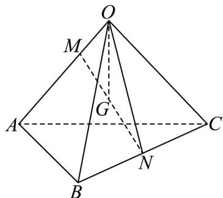

> [!faq]- 《专题02_空间向量基本定理高频题型精准突破_三大题型__高效培优期末专》官方解析
>
> > [!success]- **【答案】** B
>
> > [!note]- **【分析】**
> > 连接 ON，应用向量加法、数乘的几何意义，以 $OA = a, OB = b, OC = c$ 为基底表示出 OG，即可得
>
> > [!note]- **【解析】**
> > 连接 ON，由 $MN = \frac{MB + MC}{2}$ ，则 N 是 BC 的中点，又点 G 为 MN 的中点，
> >
> > 
> >
> > 所以 $\overline{OG} = \frac{1}{2}\overline{OM} +\frac{1}{2}\overline{ON} = \frac{1}{2}\times \frac{1}{3} OA + \frac{1}{2}\left(\frac{1}{2} OB + \frac{1}{2} OC\right) = \frac{1}{6} OA + \frac{1}{4} OB + \frac{1}{4} OC$
> >
> > 所以 $OG = \frac{1}{6}a + \frac{1}{4}b + \frac{1}{4}c$
> >
> > 故选 **B**
