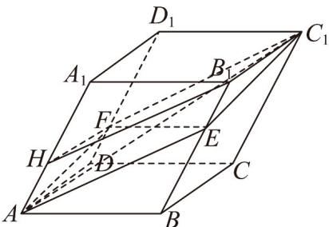

> [!faq]- 《专题02_空间向量基本定理高频题型精准突破_三大题型__高效培优期末专》官方解析
>
> > [!success]- **【答案】** ABD
>
> > [!note]- **【分析】**
> > 在 $A_{1}A$ 上取点 $H$ ，使得 $A_{1}H = 2HA$ ，可得四边形 $AHB_{1}E$ 、四边形 $HFC_{1}B_{1}$ 为平行四边形，求出 $AE / / C_1F$ ，可判断A；对 $\overline{AC_1} = \overline{AB} +\overline{AD} +\overline{AA_1}$ 两边平方求出 $\left|\overline{AC_1}\right|$ ，再由投影向量的定义可判断B；由 $\overline{EF}$ 的线性运算后再平方可判断C；由向量的夹角公式计算可判断D.
>
> > [!note]- **【解析】**
> > 对于 $\mathsf{A}$ ，在 $A_{1}A$ 上取点 $H$ ，使得 $A_{1}H = 2HA$ ，连接 $AE,C_1F,EF,B_1H$
> >
> > 
> >
> > 因为 $AH = B_{1}E, AH // B_{1}E$ ，所以四边形 $AHB_{1}E$ 为平行四边形，
> >
> > 可得 $AE = B_{1}H$ ，
> >
> > 因为 $HF = B_{1}C_{1}, HF //B_{1}C_{1}$ ，所以四边形 $HFC_{1}B_{1}$ 为平行四边形，
> >
> > 可得 $B_{1}H//C_{1}F$ ，所以 $AE//C_{1}F$ ，可得 A，E， $C_{1}$ ，F 四点共面，故 A 正确；
> >
> > 对于 B，因为平行六面体棱长均为 2， $\angle A_{1}AB = \angle A_{1}AD = \angle BAD = 60^{\circ}$
> >
> > 因为 $AC_{1} = AB + AD + AA_{1}$
> >
> > 则 $AC_{1}^{2} = AB^{2} + AD^{2} + AA_{1}^{2} + 2AB \cdot AD + 2AB \cdot AA_{1} + 2AD \cdot AA_{1} = 24$
> >
> > 则 $\left|A C_1\right| = 2\sqrt{6}$
> >
> > $\frac{\stackrel{\leftrightarrow}{AA}\cdot\stackrel{\leftrightarrow}{AC_{1}}\cdot\stackrel{\leftrightarrow}{AC_{1}}}{\left|AC_{1}\right|}\cdot\frac{\stackrel{\leftrightarrow}{AC_{1}}}{\left|AC_{1}\right|}=\frac{\left(\stackrel{\leftrightarrow}{AA_{1}}\cdot AB+ \stackrel{\leftrightarrow}{AA_{1}}\cdot AD+\stackrel{\leftrightarrow}{AA_{1}}^{2}\right)\cdot AC_{1}}{24}=\frac{1}{3}AC_{1}$ ，故 $^{B}$ 正确；
> >
> > $$
> > \text {于} ^ {\mathrm{C}}, \quad E F = A F - A E = A D + \frac {1}{3} D D _ {1} - A B - \frac {2}{3} B B _ {1} = - A B + A D - \frac {1}{3} A A _ {1}
> > $$
> >
> > $$
> > E F ^ {2} = A B ^ {2} + A D ^ {2} + \frac {1}{9} A A _ {1} ^ {2} - 2 A B \cdot A D + \frac {2}{3} A B \cdot A A _ {1} - \frac {2}{3} A D \cdot A A _ {1} = \frac {4 0}{9}
> > $$
> >
> > 则 $\left|\frac{\overrightarrow{EF}}{3}\right|=\frac{2\sqrt{10}}{3}$ ，故C不正确；
> >
> > 对于 D，故 $\frac{\left|\begin{matrix}AC_{1}\cdot EF\\AC_{1}\end{matrix}\right|}{\left|\begin{matrix}AC_{1}\end{matrix}\right|EF}|=\frac{\left(\begin{matrix}AB+AD+AA_{1}\\-AB+AD-\frac{1}{3}AA_{1}\end{matrix}\right)}{\frac{8\sqrt{15}}{3}}$
> >
> > $$
> > = \frac {- A B ^ {2} + A D ^ {2} - \frac {1}{3} A A _ {1} ^ {2} - \frac {4}{3} A B \cdot A A _ {1} + \frac {2}{3} A D \cdot A A _ {1}}{\frac {8 \sqrt {1 5}}{3}} = \frac {- \frac {8}{3}}{\frac {8 \sqrt {1 5}}{3}} = - \frac {\sqrt {1 5}}{1 5},
> > $$
> >
> > 故直线 $AC_{1}$ 与 $_{EF}$ 所成角的余弦值为 $\frac{\sqrt{15}}{15}$ ，故D正确·
> >
> > 故选 **ABD**.
