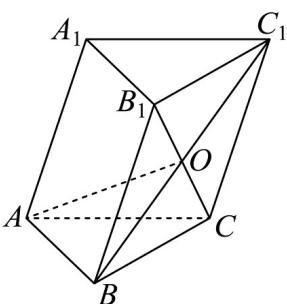

> [!faq]- 《专题02_空间向量基本定理高频题型精准突破_三大题型__高效培优期末专》官方解析
>
> > [!success]- **【答案】** C
>
> > [!note]- **【分析】**
> > 利用空间向量加减、数乘的几何意义，结合三棱柱中各线段的位置关系用 $AB$ 、 $AC$ 、 $AA_{1}$ 表示出 $AO$ ，再应用空间向量数量积的运算律求 $AO$ 的模长，从而得解．
>
> > [!note]- **【解析】**
> > 如下图所示：
> >
> > 
> >
> > 因为 $\angle A_{1}AB = \angle A_{1}AC = 60^{\circ}$ ， $\angle BAC = 90^{\circ}$ ， $A_{1}A = 2$ ， $AB = AC = 1$
> >
> > 由空间向量数量积的定义可得 $\overline{AB} \cdot \overline{AC} = 0$ ， $\overline{AB} \cdot \overline{AA}_1 = |\overline{AB}| \cdot |\overline{AA}_1| \cos 60^\circ = 1 \times 2 \times \frac{1}{2} = 1$ ，
> >
> > 同理可得 $AC \cdot AA_{1} = 1$
> >
> > 由题意可知，四边形 $BCC_{1}B_{1}$ 是平行四边形，
> >
> > $$
> > \therefore B O = \frac {1}{2} B C _ {1} = \frac {1}{2} \left(B C + B B _ {1}\right) = \frac {1}{2} B C + \frac {1}{2} A A _ {1} = \frac {1}{2} \left(A C - A B\right) + \frac {1}{2} A A _ {1}
> > $$
> >
> > $$
> > \therefore A O = A B + B O = A B + \frac {1}{2} (A C - A B) + \frac {1}{2} A A _ {1} = \frac {1}{2} A B + \frac {1}{2} A C + \frac {1}{2} A A _ {1},
> > $$
> >
> > $$
> > \therefore A O ^ {2} = \frac {1}{4} \left(A B + A C + A A _ {1}\right) ^ {2} = \frac {1}{4} \left(A B ^ {2} + A C ^ {2} + A A _ {1} ^ {2} + 2 A B \cdot A C + 2 A C \cdot A A _ {1} + 2 A B \cdot A A _ {1}\right)
> > $$
> >
> > $$
> > = \frac {1}{4} (1 + 1 + 4 + 2 \times 0 + 2 \times 1 + 2 \times 1) = \frac {5}{2}
> > $$
> >
> > 故 $\left|\overrightarrow{AO}\right|=\frac{\sqrt{10}}{2}$ ，则线段AO的长度为 $\frac{\sqrt{10}}{2}$
> >
> > 故选 **C**.
