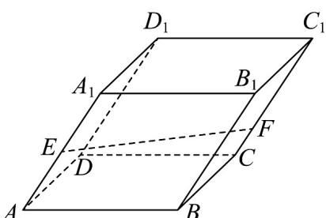

> [!faq]- 《专题02_空间向量基本定理高频题型精准突破_三大题型__高效培优期末专》官方解析
>
> > [!success]- **【答案】** B
>
> > [!note]- **【分析】**
> > 选一组基底 $\left\{AB, AD, AA_1\right\}$ ，利用空间向量基本定理即可求解
>
> > [!note]- **【解析】**
> > 由题意有 $AE = \frac{1}{2} AA_1, CF = \frac{1}{3} CC_1$ ，所以 $EF = AF - AE = AB + BC + CF - \frac{1}{2} AA_1 = AB + AD + \frac{1}{3} CC_1 - \frac{1}{2} AA_1 = AB + AD - \frac{1}{6} AA_1$ ，
> > 所以 $x = y = 1, z = -\frac{1}{6}$ ，所以 $x + y + z = 1 + 1 - \frac{1}{6} = \frac{11}{6}$ ，
> >
> > 故选：B.
> >
> > 
