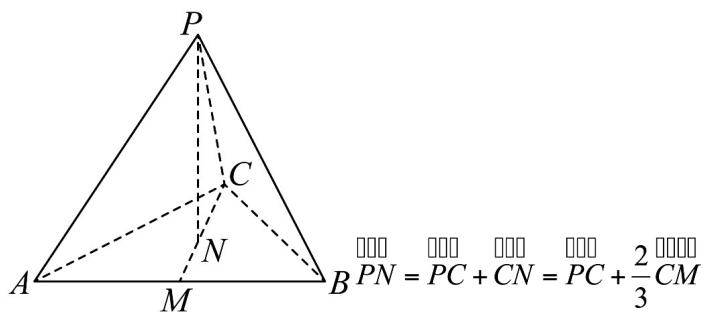

> [!faq]- 《专题02_空间向量基本定理高频题型精准突破_三大题型__高效培优期末专》官方解析
>
> > [!success]- **【答案】** D
>
> > [!note]- **【分析】**
> > 设基底为 $\overline{PA},\overline{PB},\overline{PC}$ ，选项中涉及到的向量都用基底表示出来，再验证各个选项是否正确·
>
> > [!note]- **【解析】**
> > 设基底为 $\overline{PA}, \overline{PB}, \overline{PC}$ ，由于四面体 P-ABC 为正四面体，所以可得基底的两两夹角都为 $\frac{\pi}{3}$ .
> >
> > 对于 $\mathsf{A}: \overline{BC} = \overline{PC} - \overline{PB}$ ， $\therefore \overline{PA} \cdot \overline{BC} = \overline{PA} \cdot (\overline{PC} - \overline{PB}) = \overline{PA} \cdot \overline{PC} - \overline{PA} \cdot \overline{PB}$
> >
> > $=2\times2\times\frac{1}{2}-2\times2\times\frac{1}{2}=0$ ，故A错误；
> >
> > 对于 B： $AB = PB - PA$ ，∴ $PA \cdot AB = PA \cdot (PB - PA) = PA \cdot PB - PA \cdot PA$
> >
> > $=2\times2\times\frac{1}{2}-2\times2=-2$ ，故 B 错误；
> >
> > 对于 C、D：延长 CN 交 AB 于 M，易得 M 为 AB 的中点，由于 N 是 VABC 的中心，可得 $\frac{CN}{CM} = \frac{2}{3}$ .
> >
> > 
> >
> > $$
> > = \stackrel {\square \square \square} {P C} + \frac {2}{3} \cdot \frac {\stackrel {\square \square \square} {C A} + \stackrel {\square \square \square} {C B}}{2} = \stackrel {\square \square \square} {P C} + \frac {1}{3} \cdot \left[ \left(\stackrel {\square \square \square} {P A} - \stackrel {\square \square \square} {P C}\right) + \left(\stackrel {\square \square \square} {P B} - \stackrel {\square \square \square} {P C}\right) \right]
> > $$
> >
> > $= \frac{1}{3} PA + \frac{1}{3} PB + \frac{1}{3} PC$ ，故D正确；
> >
> > 又 $\frac{1}{3} \frac{1}{PB} + \frac{1}{3} \frac{1}{PC} + \frac{1}{3} \frac{1}{PA} = \frac{1}{3} \frac{1}{PB} + \frac{1}{3} \left( \frac{1}{BC} - \frac{1}{BP} \right) + \frac{1}{3} \left( \frac{1}{BA} - \frac{1}{BP} \right) = \frac{1}{3} \frac{1}{PB} + \frac{1}{3} \frac{1}{BC} + \frac{1}{3} \frac{1}{BA}$ ，故 $C$ 错误。
> >
> > 故选 **D**.
