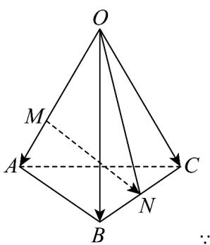

> [!faq]- 《专题02_空间向量基本定理高频题型精准突破_三大题型__高效培优期末专》官方解析
>
> > [!success]- **【答案】** B
>
> > [!note]- **【分析】**
> > 由空间向量的线性运算结合空间向量的基本定理运算求解即可·
>
> > [!note]- **【解析】**
> > 如图，连接 ON，
> >
> > 
> >
> > ## 是 的中点，
> >
> > $$
> > \therefore \begin{array}{l} \square \square \square \\ O N = \frac {1}{2} O B + \frac {1}{2} O C \end{array}
> > $$
> >
> > $\because OM = 2MA, \therefore \frac{\square\square\square\square}{OM} = \frac{2}{3} \frac{\square\square\square}{OA}$
> >
> > $$
> > \begin{array}{l} \square \square \square \\ M N = O N - O M = \frac {1}{2} O B + \frac {1}{2} O C - \frac {2}{3} O A = - \frac {2}{3} a + \frac {1}{2} b + \frac {1}{2} c \\ \therefore \end{array}
> > $$
> >
> > 故选 **B**.
