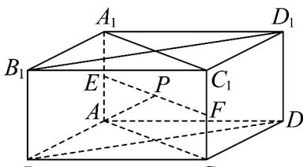
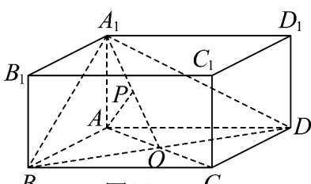
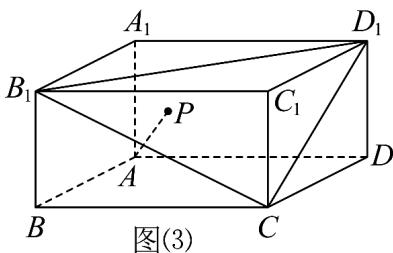

> [!faq]- 《专题02_空间向量基本定理高频题型精准突破_三大题型__高效培优期末专》官方解析
>
> > [!success]- **【答案】** ABD
>
> > [!note]- **【分析】**
> > 选项 A：若点 P 到点 B， $B_{1}$ ，D， $D_{1}$ 的距离相等，则点 P 在经过对角面 $BB_{1}D_{1}D$ 的中心，且垂直于平面 $BB_{1}D_{1}D$ 的直线上，计算即可·选项 B: AP 长度的最小值为点 A 到平面 $A_{1}BD$ 的距离·计算即可，选项 C：若 $\lambda + \mu + t = 2$ ，则点 P 在 $\triangle B_{1}D_{1}C$ 上及其内部，AP 长度的最大值为 $\sqrt{5}$ ，选项 D: 若 $4\left(\lambda^{2} + \mu^{2} - \lambda\mu\right) = t = 1$ ，则点 P 在平面 $A_{1}B_{1}C_{1}D_{1}$ 内，且在以 $A_{1}$ 为圆心，半径为 1 的圆弧上，这段圆弧的长度为 $\frac{2\pi}{3}$ ，故 D 正确·
>
> > [!note]- **【解析】**
> > 对于 A，若点 P 到点 B， $B_{1}$ ，D， $D_{1}$ 的距离相等，
> >
> > 则点 P 在经过对角面 $BB_{1}D_{1}D$ 的中心，且垂直于平面 $BB_{1}D_{1}D$ 的直线上，
> >
> > 分别取 $AA_{1}$ ， $CC_{1}$ 的中点 E，F，
> >
> > 连接 $EF$ ，如图（1），则点 $P$ 在线段 $EF$ 上，则 $t = \frac{1}{2}$ ， $\lambda = \mu$
> >
> > 所以 $\lambda -\mu +t = \frac{1}{2}$ ，故A正确；
> >
> > 
> > 图(1)
> >
> > 对于 B，若 $\lambda + \mu + t = 1$ ，则点 P 在 $\triangle A_{1}BD$ 上及其内部，
> >
> > 如图 $(2)$ ，
> >
> > 
> > 图(2)
> >
> > 则 AP 长度的最小值为点 A 到平面 $A_{1}BD$ 的距离，
> >
> > 设 O 为 AC 与 BD 的交点，则所求距离转化为点 A 到直线 $A_{1}O$ 的距离，
> >
> > 易知 $\triangle AA_{1}O$ 为等腰直角三角形，所以 $AP = \frac{\sqrt{2}}{2}$ ，故B正确；
> >
> > 对于 $C$ ，若 $\lambda +\mu +t = 2$ ，则点 $P$ 在 $\triangle B_1D_1C$ 上及其内部，
> >
> > 如图 $( ^{3} )$ ，
> >
> > 
> >
> > 则 $AP$ 长度的最大值为 $AB_{1}$ ， $AD_{1}$ ， $AC$ 中的一个，计算可得 $AB_{1} = AD_{1} = \sqrt{5}$ ， $AC = 2$
> >
> > 所以 AP 长度的最大值为 $\sqrt{5}$ ，故 C 错误；
> >
> > 对于 D，若 $4\left(\lambda^{2}+\mu^{2}-\lambda\mu\right)=t=1$ ，则 $\overline{AP}=\lambda\overline{AB}+\mu\overline{AD}+\overline{AA}_{1}=\overline{AA}_{1}+\overline{A}_{1}P$
> >
> > 所以 $A_{1}P = \lambda AB + \mu AD$
> >
> > 所以 $A_{1}P^{2} = \lambda^{2}AB^{2} + \mu^{2}AD^{2} + 2\lambda \mu AB\cdot AD = 4\lambda^{2} + 4\mu^{2} - 4\lambda \mu = 1$ ，所以 $A_{1}P = 1$
> >
> > 则点 P 在平面 $A_{1}B_{1}C_{1}D_{1}$ 内，且在以 $A_{1}$ 为圆心，半径为 $^{1}$ 的圆弧上，这段圆弧的长度为 $\frac{2\pi}{3}$ ，故 D 正确。
> >
> > 故选 **ABD**.
>
> > [!tip]- **【名师点睛】**
> > 思路点睛：利用向量的几何意义，得到具体的几何关系进行求解是关键，方法点睛：几何与代数的结合求解是关键·
