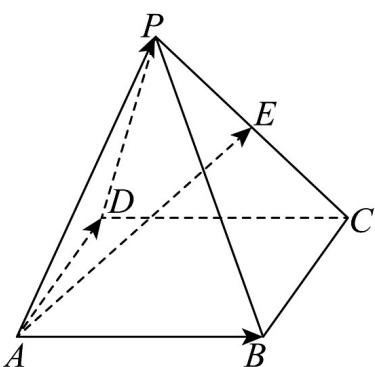
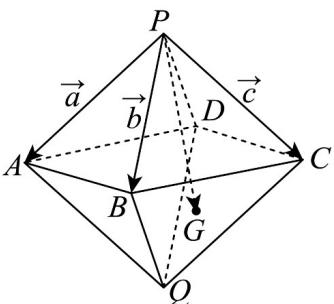
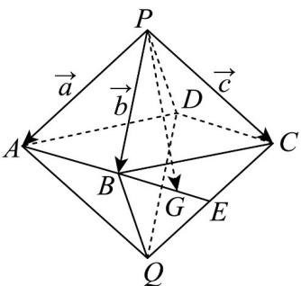

> [!faq]- 《专题02_空间向量基本定理高频题型精准突破_三大题型__高效培优期末专》官方解析
>
> > [!success]- **【答案】** A
>
> > [!note]- **【分析】**
> > 根据投影向量的定义表示出 $\overrightarrow{MA}$ 在 $\overrightarrow{CN}$ 方向上的投影向量，利用线性运算、数量积公式，以及平面向量基本定理即可求解.
>
> > [!note]- **【解析】**
> > 由题知， $\overrightarrow{MA}$ 在 $\overrightarrow{CN}$ 方向上的投影向量为 $\left|\overrightarrow{MA}\right|=\frac{\overrightarrow{MA}\cdot\overrightarrow{CN}}{\left|\overrightarrow{MA}\right|\left|\overrightarrow{CN}\right|}\times\frac{\overrightarrow{CN}}{\left|\overrightarrow{CN}\right|}$ ，
> >
> > 又 $\overrightarrow{MA}\cdot\overrightarrow{CN}=-\frac{1}{2}\left(\overrightarrow{AB}+\overrightarrow{AC}\right)\times\frac{1}{2}\left(\overrightarrow{CA}+\overrightarrow{CD}\right)$ $=-\frac{1}{2}\left(\overrightarrow{AB}+\overrightarrow{AC}\right)\times\frac{1}{2}\left(-\overrightarrow{AC}+\overrightarrow{AD}-\overrightarrow{AC}\right)=-\frac{1}{2}\left(\overrightarrow{AB}+\overrightarrow{AC}\right)\times\frac{1}{2}\left(-2\overrightarrow{AC}+\overrightarrow{AD}\right)$ $=-\frac{1}{4}\left(-2\overrightarrow{AB}\cdot\overrightarrow{AC}+\overrightarrow{AB}\cdot\overrightarrow{AD}-2\left|\overrightarrow{AC}\right|^{2}+\overrightarrow{AC}\cdot\overrightarrow{AD}\right)$
> >
> > $$
> > = - \frac {1}{4} \left(- 2 \times 1 \times 1 \times \cos 6 0 ^ {\circ} + 1 \times 1 \times \cos 6 0 ^ {\circ} - 2 \times 1 + 1 \times 1 \times \cos 6 0 ^ {\circ}\right) = \frac {1}{2},
> > $$
> >
> > $$
> > \left| \overrightarrow {C N} \right| = \sqrt {\left[ \frac {1}{2} \left(- 2 \overrightarrow {A C} + \overrightarrow {A D}\right) \right] ^ {2}} = \sqrt {\frac {1}{4} (4 + 1 - 4 \times 1 \times 1 \times \cos 6 0 ^ {\circ})} = \frac {\sqrt {3}}{2}
> > $$
> >
> > 所以 $\left|\frac{\overrightarrow{MA}}{\overrightarrow{MA}}\right|\frac{\overrightarrow{MA}\cdot\overrightarrow{CN}}{\overrightarrow{MA}\left|\overrightarrow{CN}\right|}\times\frac{\overrightarrow{CN}}{\left|\overrightarrow{CN}\right|}=\frac{2}{3}\overrightarrow{CN}$ ，所以 $\mu=\frac{2}{3}\cdot$
> >
> > 故选：A
> >
> > 41. 四棱锥 $P - ABCD$ 中，底面 $ABCD$ 是平行四边形，点 $E$ 为棱 $PC$ 的中点，若 $AE = xAB + yAD + zAP$ ，则 $x + y + z$ 等于（）
> >
> > 
> >
> > A. $\frac{3}{2}$ B. 1 C. $\frac{5}{2}$ D. 2
> >
> > 【答案】A
> >
> > 【分析】结合图形，利用向量的线性运算，即可求解·
> >
> > 【详解】
> >
> > 
> >
> > 在四棱锥 $P - ABCD$ 中，有 $\overline{AE} = \overline{AP} +\overline{PE}$
> >
> > 再由点 E 为棱 PC 的中点， $\overline{PE}=\frac{1}{2}\overline{PC}$ ，所以 $\overline{AE}=\overline{AP}+\frac{1}{2}\overline{PC}$
> >
> > $$
> > P C = P B + B C = A B - A P + B C
> > $$
> >
> > 由底面 $ABCD$ 是平行四边形，得 $\overline{BC} = \overline{AD}$
> >
> > 所以 $\overline{AE} = \overline{AP} + \frac{1}{2}\left(\overline{AB} - \overline{AP} + \overline{BC}\right) = \frac{1}{2}\overline{AB} + \frac{1}{2}\overline{AP} + \frac{1}{2}\overline{BC} = \frac{1}{2}\overline{AB} + \frac{1}{2}\overline{AP} + \frac{1}{2}\overline{AD}$ ，又因为 $\overline{AE} = x\overline{AB} + y\overline{AD} + z\overline{AP}$ ，所以 $x = \frac{1}{2}, y = \frac{1}{2}, z = \frac{1}{2}$ ，即 $x + y + z = \frac{3}{2}$ ，
> >
> > 42. 平行六面体 $ABCD - A_{1}B_{1}C_{1}D_{1}$ 中， $AC_{1} = xAB + 2yBC + 3zC_{1}C$ ，则 $x + y + z = (\quad)$ A. 1 B. $\frac{7}{6}$ C. $\frac{5}{6}$ D. $\frac{2}{3}$
> >
> > 【答案】B
> >
> > 【分析】根据空间向量线性运算法则利用 $AB, BC, C_1C$ 表示 $AC_1$ ，结合空间向量基本定理求 $x, y, z$ 可得结论。
> >
> > 【详解】由平行六面体 $ABCD - A_1B_1C_1D_1$ 可得 $AC_1 = AC + CC_1 = AB + BC - C_1C$ ，
> >
> > 又 $AC_1 = xAB + 2yBC + 3zC_1C$ ，所以 $x = 1, 2y = 1, 3z = -1$ ，
> >
> > 则 $x + y + z = 1 + \frac{1}{2} - \frac{1}{3} = \frac{7}{6}$ 。
> >
> > 故选：B
> >
> > 43．六氟化硫，化学式为 $SF_{6}$ ，常压下是一种无色、无臭、无毒、不燃的稳定气体，有良好的绝缘性，在电器工业方面具有广泛用途·六氟化硫分子结构为正八面体结构（正八面体每个面都是正三角形，可以看作是两个棱长均相等的正四棱锥将底面重合的几何体）·如图所示，在正八面体 P-ABCD-Q 中，G 是 $\triangle BCQ$ 的重心，记 PA=a，PB=b，PC=c，则 PG 等于（）
> >
> > 
> >
> > A. $-\frac{1}{3} a + \frac{1}{3} b + \frac{2}{3} c$ B. $\frac{1}{3} a - \frac{1}{3} b + \frac{2}{3} c$ C. $\frac{1}{3} a - \frac{1}{3} b - \frac{2}{3} c$ D.
> >
> > $$
> > \frac {1}{3} a + \frac {1}{3} b + \frac {2}{3} c
> > $$
> >
> > 【答案】D
> >
> > 【分析】由空间向量的线性运算求解即可·
> >
> > 【详解】易知 $PD = BQ = a + c - b$ ，设 $CQ$ 中点为 $E$ ，
> >
> > 则 $\overrightarrow{BG} = \frac{2}{3}\overrightarrow{BE} = \frac{1}{3}\left(\overrightarrow{BQ} +\overrightarrow{BC}\right) = \frac{1}{3}\left(\overrightarrow{BQ} +\overrightarrow{PC} -\overrightarrow{PB}\right) = \frac{1}{3}\left(\overrightarrow{a} -2\overrightarrow{b} +2c\right)$
> >
> > 所以 $\overrightarrow{PG} = \overrightarrow{PB} + \overrightarrow{BG} = b + \frac{1}{3} (a - 2b + 2c) = \frac{1}{3} a + \frac{1}{3} b + \frac{2}{3} c$
> >
> > 
> >
> > 故选 **D**.
