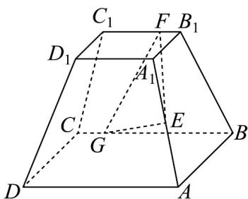

<!-- question-source:start -->
14．如图，正四棱台 $ABCD - A_1B_1C_1D_1$ 的上底面边长为 $2$ ，下底面边长为 $4$ ，高为 $3$ ， $E$ 为棱 $AA_{1}$ 的中点，点 $F$ ， $G$ 分别在棱 $B_{1}C_{1}$ ， $BC$ 上（含端点），若 $\frac{u\cdot u}{EF \cdot EG} = \frac{25}{4}$ ，则线段 $FG$ 长度的最小值为 \_\_\_\_。

<!-- question-source:end -->

![[高中/课堂同步/题库/人教A版高中数学同步讲义(2026)/04_选择性必修第二册/期末/专项训练/专题03_空间向量及其运算的坐标表示高频题型精准突破_五大题型__高效/_compact/answers/Q00060570A1.md]]
