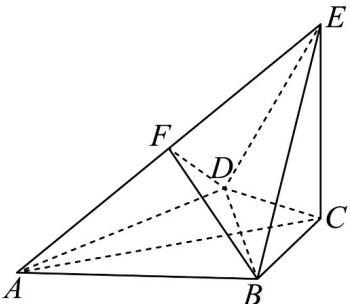

<!-- question-source:start -->
16. 如图，在四棱锥 $E - ABCD$ 中， $CE \perp$ 底面 $ABCD$ ， $AB = AD = 2\sqrt{7}$ ， $BC = BD = CD = 2$ ， $CE = 4$ ， $F$ 是棱 $AE$ 的中点，则三棱锥 $B - DEF$ 的外接球的表面积为（）

A. $\frac{64\pi}{3}$ B. $\frac{64\pi}{9}$ C. $\frac{256\pi}{9}$ D. $\frac{256\sqrt{3}\pi}{9}$
<!-- question-source:end -->

![[高中/课堂同步/题库/人教A版高中数学同步讲义(2026)/04_选择性必修第二册/期末/专项训练/专题03_空间向量及其运算的坐标表示高频题型精准突破_五大题型__高效/_compact/answers/Q00060572A1.md]]
