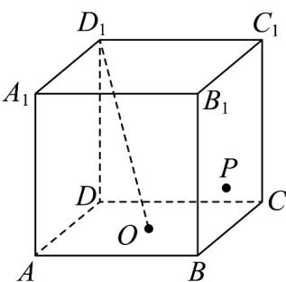

<!-- question-source:start -->
33. 如图，正方体 $ABCD - A_{1}B_{1}C_{1}D_{1}$ 的棱长为 2，点 $O$ 为底面 $ABCD$ 的中心，点 $P$ 在侧面 $BB_{1}C_{1}C$ 的边界及其内部运动。若 $D_{1}O \perp OP$ ，则 $\triangle D_{1}C_{1}P$ 面积的最大值为（）

A. 2 B. $\frac{4\sqrt{5}}{5}$ C. $2\sqrt{2}$ D. $\sqrt{5}$
<!-- question-source:end -->

![[高中/课堂同步/题库/人教A版高中数学同步讲义(2026)/04_选择性必修第二册/期末/专项训练/专题03_空间向量及其运算的坐标表示高频题型精准突破_五大题型__高效/_compact/answers/Q00060589A1.md]]
