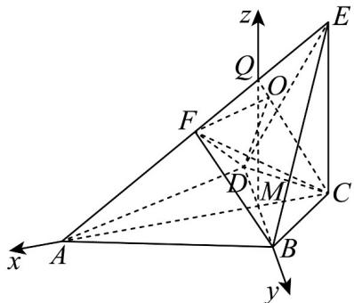

> [!faq]- 《专题03_空间向量及其运算的坐标表示高频题型精准突破_五大题型__高效》官方解析
>
> > [!success]- **【答案】** A
>
> > [!note]- **【分析】**
> > 分析得到三棱锥 B-DEF 的外接球的球心 O 在平面 ACE 上，作出辅助线，得到三棱锥 B-DEF 的外接球的球心 O 在直线 QC 上，建立空间直角坐标系，写出点的坐标，因为 O 在 QC 上，设 $\overline{CO} = \lambda \overline{CQ} = (\sqrt{3}\lambda, 0, 3\lambda)$ ，所以 O 的坐标为 $(\sqrt{3}(\lambda - 1), 0, 3\lambda)$ ，利用 OB = OE 得到方程，解得 $\lambda = \frac{2}{3}$ ，进而得到外接球半径，得到表面积·
>
> > [!note]- **【解析】**
> > 因为 AB = AD，BC = CD，所以 $AC \perp BD$ ，设 $AC \cap BD = M$ ，则 M 为 BD 的中点，
> >
> > 因为 CE ⊥ 平面 ABCD，AC，BD ⊂ 平面 ABCD，所以 BD ⊥ CE，AC ⊥ CE，
> >
> > 因为 AC，CE ⊂ 平面 ACE，AC ∩ CE = C，所以 BD ⊥ 平面 ACE，
> >
> > 由题意知 $MB = MD = \frac{1}{2} BD = 1$ ，
> >
> > 所以三棱锥 B-DEF 的外接球的球心 O 在平面 ACE 上·
> >
> > BC = BD = CD = 2，故 $\triangle BCD$ 为等边三角形，故 $MC = BC \sin 60^{\circ} = \sqrt{3}$ ，
> >
> > 又 $AB = AD = 2\sqrt{7}$ ，故 $MA = \sqrt{AB^2 - BM^2} = 3\sqrt{3}$ ， $AC = MA + MC = 4\sqrt{3}$
> >
> > 又 $CE = 4$ ，故 $AE = \sqrt{CE^2 + AC^2} = 8$
> >
> > 如图，取棱 $AE$ 的靠近 $E$ 的四等分点 $\mathcal{Q}$
> >
> > 
> >
> > 则 $Q$ 为线段 $EF$ 的中点， $QM\| CE$ ，因为 $F$ 为 $AE$ 的中点，所以 $CF = \frac{1}{2} AE = 4$ ，所以 $CF = CE$ ，所以 $QC \perp EF$ ，所以三棱锥 $B - DEF$ 的外接球的球心 $O$ 在直线 $QC$ 上，以 $M$ 为坐标原点， $MA, MB, MQ$ 分别为 $x$ 轴， $y$ 轴， $z$ 轴，建立如图所示的空间直角坐标系 $Mxyz$ ，则 $A(3\sqrt{3},0,0)$ ， $B(0,1,0)$ ， $C(-\sqrt{3},0,0)$ ， $E(-\sqrt{3},0,4)$ ， $Q(0,0,3)$ ，所以 $CQ = (\sqrt{3},0,3)$ ，因为 $O$ 在 $QC$ 上，设 $CO = \lambda CQ = (\sqrt{3}\lambda,0,3\lambda)$ ，所以 $O$ 的坐标为 $(\sqrt{3}(\lambda - 1),0,3\lambda)$ ，又 $OB = OE$ ，即 $\sqrt{3(\lambda - 1)^2 + 1 + 9\lambda^2} = \sqrt{3\lambda^2 + (3\lambda - 4)^2}$ ，解得 $\lambda = \frac{2}{3}$ ，故 $O\left(-\frac{\sqrt{3}}{3},0,2\right)$ ，所以 $OE = \sqrt{\left(-\sqrt{3} + \frac{\sqrt{3}}{3}\right)^2 + 0 + (4 - 2)^2} = \sqrt{\frac{16}{3}}$ ，所以 $S = 4\pi \cdot OE^2 = 4\pi \cdot \frac{16}{3} = \frac{64\pi}{3}$ .
> >
> > 故选 **A**.
