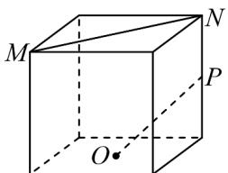
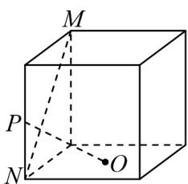
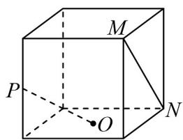
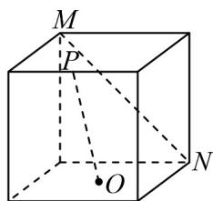

<!-- question-source:start -->
2. 如图，下列正方体中， $O$ 为下底面的中心， $M, N$ 为正方体的顶点， $P$ 为所在棱的中点，则满足直线

$MN \perp OP$ 的是（）

A

B

C

D

<!-- question-source:end -->

![[高中/课堂同步/题库/人教A版高中数学同步讲义(2026)/04_选择性必修第二册/期末/专项训练/专题04_空间向量的应用高频题型精准突破_五大题型__高效培优期末专项/_compact/answers/Q00060607A1.md]]
