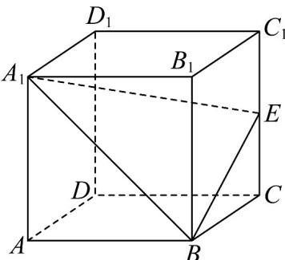

<!-- question-source:start -->
13. 在直四棱柱 $ABCD - A_1B_1C_1D_1$ 中，底面 $ABCD$ 是菱形， $\angle BAD = \frac{\pi}{3}$ ， $AB = AA_1 = 2$ ， $E$ 为 $CC_1$ 的中点，点 $F$ 满足 $DF = \lambda DC + \mu DD_1$ ， $\lambda \in [0,1]$ ， $\mu \in [0,1]$ ，下列结论正确的是（）

A. 若 $\lambda = 1$ ，则 $AF \perp BD$

B．若 $\lambda + \mu = 1$ ，则四面体 $A_{1} - BEF$ 的体积是定值

C. 若 $\lambda = 1$ ， $\mu = \frac{1}{2}$ ，则存在点 $P \in A_1B$ ，使得 $AP + PF$ 的最小值为 $9 + 2\sqrt{10}$

D．若 $B_{1}F\perp EF$ ，则点F的轨迹长为 $\frac{\sqrt{2}}{2}\pi$
<!-- question-source:end -->

![[高中/课堂同步/题库/人教A版高中数学同步讲义(2026)/04_选择性必修第二册/期末/专项训练/专题04_空间向量的应用高频题型精准突破_五大题型__高效培优期末专项/_compact/answers/Q00060617A1.md]]
