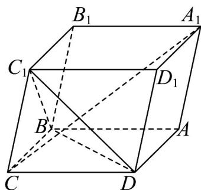

<!-- question-source:start -->
24. 如图，在平行六面体 $ABCD - A_{1}B_{1}C_{1}D_{1}$ 中， $CB = CD = CC_{1} = 2$ 且 $\angle C_{1}CB = \angle C_{1}CD = \angle BCD = 60^{\circ}$ .

(1)求 $AC_{1}$ 的长度；

(2)求证： $CA_{1} \perp$ 平面 $C_{1}BD$ .
<!-- question-source:end -->

![[高中/课堂同步/题库/人教A版高中数学同步讲义(2026)/04_选择性必修第二册/期末/专项训练/专题04_空间向量的应用高频题型精准突破_五大题型__高效培优期末专项/_compact/answers/Q00060628A1.md]]
