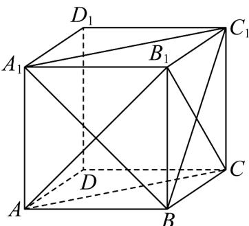

<!-- question-source:start -->
32. 如图，在正方体 $ABCD - A_{1}B_{1}C_{1}D_{1}$ 中，记平面 $A_{1}C_{1}B$ 与平面 $ABCD$ 的交线为 $l$ ，则下列结论正确的是（）

A. $l / /$ 平面 $AB_{1}C$ B. $l\bot AB$

C. $l$ 与 $BC_{1}$ 所成角大小为 $\frac{\pi}{3}$ D. $l \perp BD_{1}$
<!-- question-source:end -->

![[高中/课堂同步/题库/人教A版高中数学同步讲义(2026)/04_选择性必修第二册/期末/专项训练/专题04_空间向量的应用高频题型精准突破_五大题型__高效培优期末专项/_compact/answers/Q00060634A1.md]]
