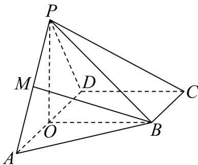

<!-- question-source:start -->
35. 如图，在四棱锥 $P - ABCD$ 中，底面 $ABCD$ 为直角梯形， $\angle ADC = \angle BCD = 90^{\circ}$ ， $BC = 1$ ， $CD = \sqrt{3}$ ， $PD = 2$ ， $\angle PDA = 60^{\circ}$ ， $\angle PAD = 30^{\circ}$ ，且平面 $PAD \perp$ 平面 $ABCD$ ，在平面 $ABCD$ 内过 $B$ 作 $BO \perp AD$ ，交 $AD$ 于 $O$ ，连 $PO$ .

(1)求证： $PO \perp$ 平面 ABCD；

(2)求面 $APB$ 与面 $PBC$ 所成角的正弦值；

(3)在线段 $PA$ 上存在一点 $M$ ，使直线 $BM$ 与平面 $PAD$ 所成的角的正弦值为 $\frac{2\sqrt{7}}{7}$ ，求 $PM$ 的长
<!-- question-source:end -->

![[高中/课堂同步/题库/人教A版高中数学同步讲义(2026)/04_选择性必修第二册/期末/专项训练/专题04_空间向量的应用高频题型精准突破_五大题型__高效培优期末专项/_compact/answers/Q00060636A1.md]]
