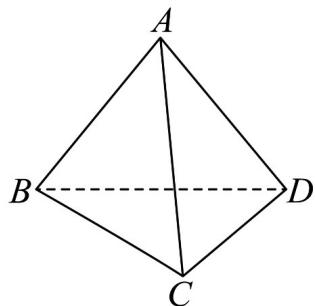

<!-- question-source:start -->
37. 如图，在三棱锥 $A - BCD$ 中， $AC = AD = BC = BD = 2\sqrt{3}$ ， $AB = CD = 4$ ，点 $F$ 在棱 $AB$ 上（不与端点重合），直线 $_{AF}$ 与平面 $FCD$ 所成角的正弦值为 $\frac{2\sqrt{5}}{5}$ .

(1)求异面直线 AB，CD 所成角的正弦值；

(2)求 $\frac{|AF|}{|BF|}$ 的值.
<!-- question-source:end -->

![[高中/课堂同步/题库/人教A版高中数学同步讲义(2026)/04_选择性必修第二册/期末/专项训练/专题04_空间向量的应用高频题型精准突破_五大题型__高效培优期末专项/_compact/answers/Q00060638A1.md]]
