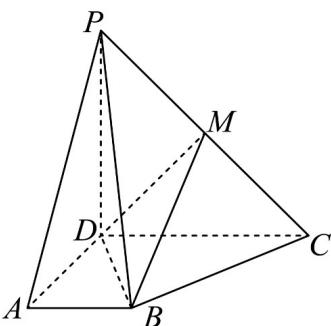

<!-- question-source:start -->
38. 如图，在四棱锥 $P - ABCD$ 中， $PD \perp$ 平面 $ABCD$ ， $AD \perp CD$ ， $AB // CD$ ， $AB = 2$ ， $AD = CD = PD = 4$ ， $M$ 为 $PC$ 中点。

(1)求证： $BM / /$ 平面PAD；

(2)求三棱锥 P-ABD 的外接球的体积；

(3)线段 $P_A$ 上（不含端点）是否存在点 $N$ ，使得 $DN$ 与平面 $MBD$ 所成角为 $\frac{\pi}{4}$ ？若存在，确定 $N$ 点的位置；若不存在，请说明理由·
<!-- question-source:end -->

![[高中/课堂同步/题库/人教A版高中数学同步讲义(2026)/04_选择性必修第二册/期末/专项训练/专题04_空间向量的应用高频题型精准突破_五大题型__高效培优期末专项/_compact/answers/Q00060639A1.md]]
