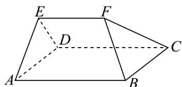

<!-- question-source:start -->
40. 如图所示，在五面体 $ABCDEF$ 中，已知平面 $ADE \perp$ 平面 $ABCD$ ，底面 $ABCD$ 是平行四边形， $VADE$ 是正三角形， $AB \perp DE, AB = 4, AD = 2, EF = 3$ .

(1)证明： $EF \parallel$ 平面ABCD；

(2)证明：四边形ABCD为矩形；

(3)若点 $M$ 是棱 $EF$ 上的动点，且直线 $AE$ 与平面 $BCM$ 所成角的正弦值为 $\frac{3}{4}$ ，求 $\frac{EM}{EF}$ 的值·
<!-- question-source:end -->

![[高中/课堂同步/题库/人教A版高中数学同步讲义(2026)/04_选择性必修第二册/期末/专项训练/专题04_空间向量的应用高频题型精准突破_五大题型__高效培优期末专项/_compact/answers/Q00060641A1.md]]
