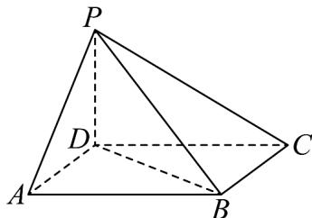

<!-- question-source:start -->
41. 如图，四棱锥 $P - ABCD$ 中，底面 $ABCD$ 为平行四边形， $\angle DAB = 60^{\circ}$ ， $AB = 2AD = 2$ ， $PD \perp$ 底面 $ABCD$ .

(1)证明： $PA \perp BD$ ；

(2)若 $PD = AD$ ，求二面角 $A - PB - C$ 的余弦值；

(3)在 $(2)$ 的条件下，求点A到平面PBC的距离.
<!-- question-source:end -->

![[高中/课堂同步/题库/人教A版高中数学同步讲义(2026)/04_选择性必修第二册/期末/专项训练/专题04_空间向量的应用高频题型精准突破_五大题型__高效培优期末专项/_compact/answers/Q00060642A1.md]]
