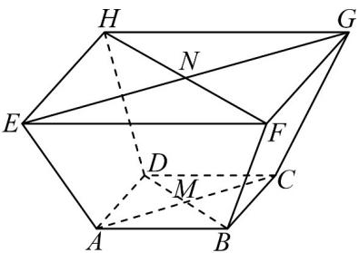

<!-- question-source:start -->
46. 如图，四棱台 $ABCD - EFGH$ 中，上、下底面均是正方形，且侧面是全等的等腰梯形， $EF = 2AB = 2\sqrt{2}$ ，上下底面中心的连线 $MN$ 垂直于上下底面，且 $MN$ 与侧面所成的角为 $45^{\circ}$

(1)求点 $A$ 到平面 $MHG$ 的距离；

(2)求平面 EHM 与平面 GHM 夹角的余弦值.
<!-- question-source:end -->

![[高中/课堂同步/题库/人教A版高中数学同步讲义(2026)/04_选择性必修第二册/期末/专项训练/专题04_空间向量的应用高频题型精准突破_五大题型__高效培优期末专项/_compact/answers/Q00060647A1.md]]
