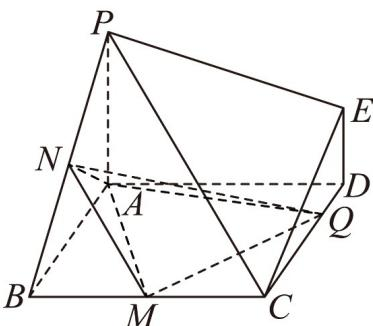

<!-- question-source:start -->
49. 如图，在多面体 $ABCDEP$ 中， $PA \perp$ 平面 $ABCD$ ，四边形 $ABCD$ 是正方形，且 $DE // PA$

$PA = AB = 2DE = 2$ ，M,N 分别是线段 BC, PB 的中点，Q 是线段 DC 上的一个动点（不含端点 D,C），则下列说法正确的是（）

A. 存在点 $Q$ ，使得 $NQ \perp PB$ B. 不存在点 $Q$ ，使得异面直线 $NQ$ 与 $PE$ 所成的角为 $30^{\circ}$ C. 当点 $Q$ 运动到 $DC$ 中点时，平面 $QMN$ 的法向量可以为 $(1,1,2)$ D. 三棱锥 $Q - AMN$ 体积的取值范围为 $\left(\frac{1}{3}, \frac{2}{3}\right)$
<!-- question-source:end -->

![[高中/课堂同步/题库/人教A版高中数学同步讲义(2026)/04_选择性必修第二册/期末/专项训练/专题04_空间向量的应用高频题型精准突破_五大题型__高效培优期末专项/_compact/answers/Q00060650A1.md]]
