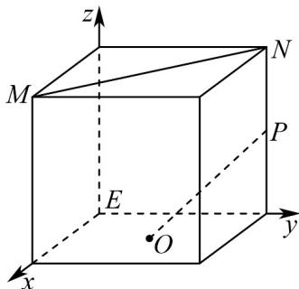
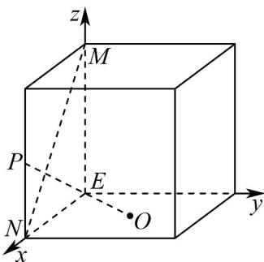
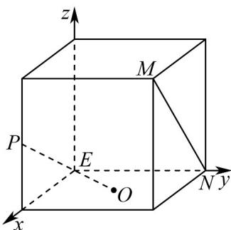
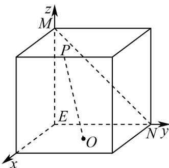

> [!faq]- 《专题04_空间向量的应用高频题型精准突破_五大题型__高效培优期末专项》官方解析
>
> > [!success]- **【答案】** B
>
> > [!note]- **【分析】**
> > 在正方体中，对各选项建立相应的空间直角坐标系，验证 $MN \cdot OP$ 是否等于 $0$ 即可·
>
> > [!note]- **【解析】**
> > 在正方体中，对各选项建立相应的空间直角坐标系，令正方体棱长为 $^{2}$
> >
> > 对于 A， $O(1,1,0)$ ， $M(2,0,2)$ ， $N(0,2,2)$ ， $P(0,2,1)$ ， $MN = (-2,2,0)$ ， $OP = (-1,1,1)$
> >
> > 则 $MN \cdot OP = (-2) \times (-1) + 2 \times 1 + 0 \times 1 = 4 \neq 0$ ， $MN$ 与 $OP$ 不垂直， $A$ 不是；
> >
> > 
> >
> > 对于 B， $O(1,1,0)$ ， $M(0,0,2)$ ， $N(2,0,0)$ ， $P(2,0,1)$ ， $MN=(2,0,-2)$ ， $OP=(1,-1,1)$
> >
> > 则 $MN \cdot OP = 2 \times 1 + 0 \times (-1) + (-2) \times 1 = 0, MN \perp OP$ ，B 是；
> >
> > 
> >
> > 对于 $\mathbb{C}$ ， $O(1,1,0),M(2,2,2),N(0,2,0),P(2,0,1),MN = (-2,0,-2),OP = (1,-1,1)$
> >
> > 则 $MN \cdot OP = (-2) \times 1 + 0 \times (-1) + (-2) \times 1 = -4 \neq 0, MN$ 与 $OP$ 不垂直，C不是；
> >
> > 
> >
> > 对于 D， $O(1,1,0)$ ， $M(0,0,2)$ ， $N(0,2,0)$ ， $P(2,1,2)$ ， $MN=(0,2,-2)$ ， $OP=(1,0,2)$
> >
> > 则 $MN \cdot OP = 0 \times 1 + 2 \times 0 + (-2) \times 2 = -4 \neq 0$ ， $MN$ 与 $OP$ 不垂直， $D$ 不是.
> >
> > 
> >
> > 故选 **B**.
