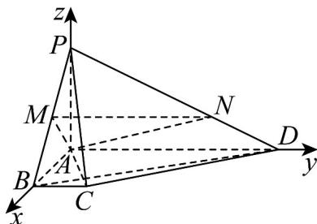

> [!faq]- 《专题04_空间向量的应用高频题型精准突破_五大题型__高效培优期末专项》官方解析
>
> > [!success]- **【答案】** (1)证明见解析； (2) $\frac{6}{17}$ .
>
> > [!note]- **【分析】**
> > （1）利用向量数量积证得 $AC \perp BD$ ，再利用线面垂直的性质与判定定义即可证明；
> >
> > (2) 建立合适的空间直角坐标系得平面 $AMN$ 的一个法向量，再设 $PQ = tPC$ ，根据垂直关系得 $t$ 值，最后利用体积公式即可·
>
> > [!note]- **【解析】**
> > （1）由题意知 $AC = AB + BC = AB + \frac{AD}{4}, BD = AD - AB$
> >
> > 因为 $\vec{AC} \cdot \vec{BD} = \left( \vec{AB} + \frac{\vec{AD}}{4} \right) \cdot (AD - \vec{AB}) = 0 - 4 + 4 - 0 = 0$
> >
> > 所以 $AC \perp BD$ ，又 $PA \perp$ 平面 ABCD，又 $BD \subset$ 平面 ABCD，
> >
> > 所以 $PA \perp BD$ ，又 $PA, AC \subset$ 平面 PAC，且 $PA \cap AC = A$
> >
> > 所以 $BD \perp$ 平面 PAC ，又 $PC \subset$ 平面 PAC ，所以 $PC \perp BD$ .
> >
> > (2) 因为 $PA \perp$ 平面 $ABCD$ , 又 $AB, AD \subset$ 平面 $ABCD$
> >
> > 所以 $PA \perp AD, PA \perp AB$ ，又 $AD \perp AB$ ，所以 AP, AB, AD 两两垂直，
> >
> > 如图以 A 为原点， $AB, AD, AP$ 的方向分别为 x，y，z 轴的正方向建立空间直角坐标系，
> >
> > 则 $A(0,0,0),M(1,0,1),N\left(0,\frac{8}{3},\frac{2}{3}\right),C(2,1,0),P(0,0,2)$
> >
> > 所以 $AC=(2,1,0)$ , AP=(0,0,2), AM=(1,0,1), AN= $\left(0,\frac{8}{3},\frac{2}{3}\right)$ ,
> >
> > 设平面 $AMN$ 的一个法向量为 $n = (x,y,z)$
> >
> > 则 $\left\{ \begin{array}{l} \rightarrow \square \square \square \\ n \cdot AM = x + z = 0 \\ \rightarrow \square \square \\ n \cdot AN = \frac{8y}{3} + \frac{2z}{3} = 0 \end{array} \right.$
> >
> > 不妨令 x=4 ，则 y=1,z=-4 所以 $n=(4,1,-4)$ .
> >
> > 设 $\overline{PQ}=t\overline{PC},0<t<1$ ，则 $\overline{AQ}=t\overline{AC}+(1-t)\overline{AP}=t(2,1,0)+(1-t)(0,0,2)=(2t,t,2-2t)$
> >
> > 因为 A, M, Q, N 四点共面，则 $AQ \cdot n = 8t + t - 8(1 - t) = 0$ ，解得 $t = \frac{8}{17}$ ，
> >
> > 即 $\overline{PQ}=\frac{8}{17}\overline{PC}$ ，所以 $V_{Q-ABC}=\left(1-\frac{8}{17}\right)V_{P-ABC}=\frac{9}{17}V_{P-ABC}=\frac{9}{17}\times\frac{1}{3}\times\frac{1}{2}\times1\times2\times2=\frac{6}{17}$
> >
> > 
