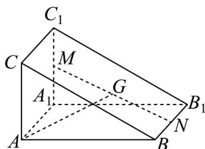
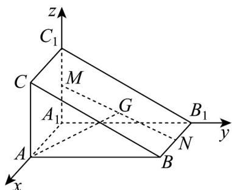
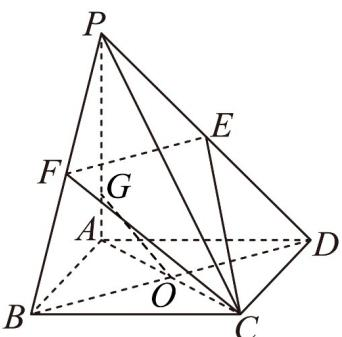
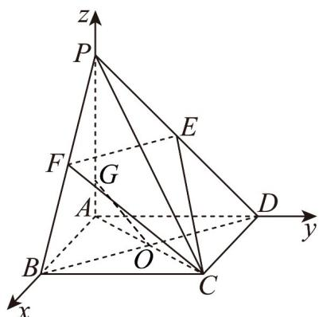

> [!faq]- 《专题04_空间向量的应用高频题型精准突破_五大题型__高效培优期末专项》官方解析
>
> > [!success]- **【答案】** (1) $2\sqrt{6}$ (2)证明见解析
>
> > [!note]- **【分析】**
> > （1）利用基底表示向量 $CA_{1}$ ，再根据数量积公式，即可求解；
> >
> > (2) 根据线面垂直的判断定理转化为证明线线垂直，再根据向量数量积公式，即可证明
>
> > [!note]- **【解析】**
> > （1）设 $\overline{CB}=a,\overline{CD}=b,\overline{CC_{1}}=c$
> >
> > 由于 $CB = CD = CC_{1} = 2$ ，即 $\left| a \right| = \left| b \right| = \left| c \right|$ ，
> >
> > 所以 $c \cdot a = |c||a|\cos60^{\circ} = \frac{1}{2}|a|^{2}$ ，同理可得 $a \cdot b = b \cdot c = \frac{1}{2}|a|^{2}$
> >
> > 由题意可得 $\overline{CA}_{1}=a+b+c$
> >
> > 所以 $\left|CA_{1}\right|=\sqrt{\left|a+b+c\right|^{2}}=\sqrt{a^{2}+b^{2}+c^{2}+2a\cdot b+2a\cdot c+2b\cdot c}=2\sqrt{6}$
> >
> > (2) 因为 $BD = b - a$
> >
> > 所以 $CA_{1} \cdot BD = (a + b + c) \cdot (b - a) = b^{2} - a^{2} + c \cdot b - c \cdot a = 0$
> >
> > 所以 $CA_{1} \perp BD$ ，同理可证 $CA_{1} \perp BC_{1}$
> >
> > 又因为 $BD \cap BC_{1} = B, BD, BC_{1} \subset$ 平面 $C_{1}BD$
> >
> > 所以 $CA_{1} \perp$ 平面 $C_{1}BD$ .
> >
> > 25．《九章算术》中的“商功”篇主要讲述了以立体几何为主的各种形体体积的计算，其中堑堵是指底面为直角三角形的直棱柱·如图，在堑堵 $ABC-A_{1}B_{1}C_{1}$ 中，M，N分别是 $A_{1}C_{1}$ ， $BB_{1}$ 的中点，G是MN的中点·判断直线AG与平面 $A_{1}B_{1}C_{1}$ 是否相交？\_\_\_\_（填“是”或“不是”）；若 $AG=xAB+yAA_{1}+zAC$ ，则 $x+y+z=$ \_\_\_\_。
> >
> > 
> >
> > 【答案】 是 $\frac{3}{2}$
> >
> > 【分析】如图建系，求得各点坐标，进而可得平面 $A_{1}B_{1}C_{1}$ 法向量 $\stackrel{\square\square}{A}_{1}A$ 与 $AG$ ，根据 $\stackrel{\square\square}{A}_{1}A\cdot AG\neq 0$ ，分析判断，即可得答案；根据向量的线性运算法则，可求得 $x,y,z$ 的值，即可得答案·
> >
> > 【详解】以 $A_{1}$ 为原点， $A_{1}A, A_{1}B_{1}, A_{1}C_{1}$ 为 x, y, z 轴正方向建系，如图所示，
> >
> > 
> >
> > 设 $A_{1}A = a, A_{1}B_{1} = b, A_{1}C_{1} = c$
> >
> > 则 $A_{1}(0,0,0), A(a,0,0), M\left(0,0,\frac{c}{2}\right), N\left(\frac{a}{2}, b,0\right)$
> >
> > 所以 $G\left(\frac{a}{4},\frac{b}{2},\frac{c}{4}\right)$ ,
> > 所以 $AG = \left(-\frac{3a}{4}, \frac{b}{2}, \frac{c}{4}\right), A_{1}A = (a, 0, 0)$ 因为 $A_{1}A \perp$ 平面 $A_{1}B_{1}C_{1}$ ，
> > 所以 $A_{1}A$ 为平面 $A_{1}B_{1}C_{1}$ 的法向量，
> > 因为 $A_{1}A \cdot AG = -\frac{3a^{2}}{4} \neq 0$ 所以 $A_{1}A$ 与 AG 不垂直，即直线 AG 与直线 $A_{1}A$ 不垂直，
> > 所以直线 AG 与平面 $A_{1}B_{1}C_{1}$ 相交.
> > 由题意 $AG = \frac{1}{2}(AM + AN) = \frac{1}{2}(AA_{1} + \frac{1}{2}AC + AB + \frac{1}{2}AA_{1})$ $=\frac{1}{2}AB+\frac{3}{4}AA_{1}+\frac{1}{4}AC$ 所以 $x=\frac{1}{2},y=\frac{3}{4},z=\frac{1}{4}$ ，则 $x+y+z=\frac{3}{2}$ .
> > 故答案为：是； $\frac{3}{2}$
> >
> > 26. 《九章算术》是我国古代的数学名著，书中将底面为矩形，且有一条侧棱垂直于底面的四棱锥称为阳马。如图，在阳马 $P - ABCD$ 中， $PA \perp$ 平面 $ABCD$ ，底面 $ABCD$ 是正方形， $E$ ， $F$ 分别为 $PD$ ， $PB$ 的中点，点 $G$ 在线段 $AP$ 上， $AC$ 与 $BD$ 交于点 $O$ ， $PA = AB = 2$ ，若 $OG //$ 平面 $EFC$ ，则 $AG = (\quad)$
> >
> > 
> >
> > 【答案】D
> >
> > A. $\frac{1}{3}$ B. $\frac{1}{2}$ C. $\frac{3}{4}$ D. $\frac{2}{3}$
> > 【分析】以点 A 为坐标原点， $\overset{\cup\cup}{AB}$ ， $\overset{\cup\cup}{AD}$ ， $\overset{\cup\cup}{AP}$ 的方向分别为 x，y，z 轴的正方向建立空间直角坐标系，求出平面 EFC 的法向量 m，设 $G(0,0,a)$ ，由 $OG \cdot m = 0$ 求出 a 即可。
> >
> > 【详解】∵PA⊥平面ABCD，AB,AD⊂平面ABCD
> >
> > $$
> > P A \perp A B, P A \perp A D
> > $$
> >
> > $$
> > A B C D
> > $$
> >
> > $$
> > \therefore A B \perp A D
> > $$
> >
> > $$
> > P A, A B, A D
> > $$
> >
> > 以点 $A$ 为坐标原点， $\overline{AB}$ ， $\overline{AD}$ ， $\overline{AP}$ 的方向分别为 $x$ ， $y$ ， $z$ 轴的正方向建立空间直角坐标系，
> >
> > $$
> > P A = A B = 2
> > $$
> >
> > $$
> > O (1, 1, 0), C (2, 2, 0), E (0, 1, 1), F (1, 0, 1), \stackrel {{\text {UUU}}} {{E F}} = (1, - 1, 0), \stackrel {{\text {UUU}}} {{E C}} = (2, 1, - 1)
> > $$
> >
> > 设平面 $EFC$ 的法向量为 $m=(x,y,z)$ ，则 $\left\{\begin{aligned} &EE \cdot m = x - y = 0 \\ &EC \cdot m = 2x + y - z = 0 \end{aligned}\right.$
> >
> > $$
> > m = (1, 1, 3)
> > $$
> >
> > $$
> > G (0, 0, a)
> > $$
> >
> > $$
> > \stackrel {{\square \sqcup \sqcup}} {{O G}} = (- 1, - 1, a)
> > $$
> >
> > $$
> > \because O G \parallel
> > $$
> >
> > $$
> > E F C
> > $$
> >
> > $$
> > \therefore \stackrel {{\text { U   U   U }}} {{O G}} \perp m
> > $$
> >
> > $$
> > \stackrel {\mathrm{u}} {\boldsymbol {O}} \boldsymbol {G} \cdot \boldsymbol {m} = 0
> > $$
> >
> > $$
> > - 1 \times 1 - 1 \times 1 + 3 a = 0
> > $$
> >
> > 解得 $a = \frac{2}{3}$ ，故 $AG = \frac{2}{3}$
> >
> > 故选：D.
> >
> > 
