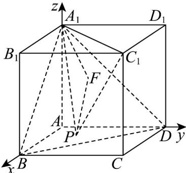

> [!faq]- 《专题04_空间向量的应用高频题型精准突破_五大题型__高效培优期末专项》官方解析
>
> > [!success]- **【答案】** ACD
>
> > [!note]- **【分析】**
> > 利用三棱锥的体积公式即可求解选项A；利用空间向量求二面角的方法即可判断选项B，利用线面角的定义即可判断选项C，利用作对称点的方法即可求解选项D.
>
> > [!note]- **【解析】**
> > 对于选项 A， $S_{\triangle A_{1}B_{1}C_{1}}=2$ ，点 P 到平面 $A_{1}B_{1}C_{1}$ 的距离 d=2，
> >
> > 所以 $V_{P-A_{1}B_{1}C_{1}}=\frac{1}{3}S_{\triangle A_{1}B_{1}C_{1}}\times d=\frac{4}{3}$ ，则 A 正确；
> >
> > 对于选项B，以A为坐标原点，分别以 $AB, AD, AA_{1}$ 为 $x$ 轴， $y$ 轴， $z$ 轴建立空间直角坐标系，
> >
> > $$
> > A _ {1} B _ {1} C _ {1}
> > $$
> >
> > $$
> > m = (0, 0, 1)
> > $$
> >
> > $$
> > P (x, y, 0)
> > $$
> >
> > 则 $A_{1}C_{1} = (2,2,0)$ ， $A_{1}P = (x,y, - 2)$ ，设平面 $PA_{1}C_{1}$ 的法向量为 $n = (x_1,y_1,z_1)$
> >
> > 则 $\left\{\begin{aligned}&A_{1}C_{1}\cdot n=2x_{1}+2y_{1}=0\\ &A_{1}P\cdot n=xx_{1}+yy_{1}-2z_{1}=0\end{aligned}\right.$ ，令 $x_{1}=1$ ，则 $y_{1}=-1$ ， $z_{1}=\frac{x-y}{2}$ ，即 $n=\left(1,-1,\frac{x-y}{2}\right)$ ，
> >
> > 设 $\cos m, n = \frac{m \cdot n}{|m| \cdot |n|} = \frac{x - y}{\sqrt{8 + (x - y)^2}}$ ，由此可知二面角 $P - A_{1}C_{1} - B_{1}$ 不为定值，故错误；
> >
> > 对于选项 C，设 $A_{1}P$ 与平面 $A_{1}BD$ 的夹角为 $\theta$ ，
> >
> > 当点 $P$ 在 $BD$ 所在的直线上时， $A_{1}P \subset$ 平面 $A_{1}BD$
> >
> > $$
> > \sin \theta = 0
> > $$
> >
> > $$
> > A _ {1} B D
> > $$
> >
> > $$
> > P F
> > $$
> >
> > $$
> > F
> > $$
> >
> > $$
> > \angle P A _ {1} F
> > $$
> >
> > $$
> > A _ {1} P
> > $$
> >
> > $$
> > A _ {1} D B
> > $$
> >
> > $$
> > \angle P A _ {1} F
> > $$
> >
> > 设点 A 到平面 $A_{1}BD$ 的距离为 d，由 $V_{A-A_{1}BD}=V_{A_{1}-ABD}$ 得 $\frac{1}{3}\times2\times2=\frac{1}{3}\times2\sqrt{3}\times d$ ，解得 $d=\frac{2\sqrt{3}}{3}$ 即 $\sin\theta_{\max}=\frac{d}{A_{1}A}=\frac{\sqrt{3}}{3}$ ，则直线 $A_{1}P$ 与平面 $A_{1}DB$ 所成角的正弦值取值范围为 $\left[0,\frac{\sqrt{3}}{3}\right]$ ，则 C 正确；
> > 对于选项 D，若 $A_{1}$ 关于点 A 的对称点 $A_{2}(0,0,-2)$ ， $A_{1}P + PC_{1} = A_{2}P + PC_{1}$ ， $A_{2}C_{1}$ ，
> > 当且仅当 $A_{2}, P, C_{1}$ 三点共线时等号成立，则 $\left(A_{1}P + PC_{1}\right)_{\min} = A_{2}C_{1} = 2\sqrt{6}$ ，则 D 正确；
> > 故选：ACD.
> >
> > 
> >
> > ## 考点 04 用空间向量研究夹角问题
