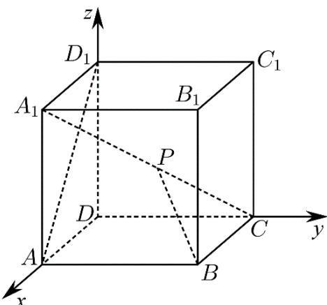

> [!faq]- 《专题04_空间向量的应用高频题型精准突破_五大题型__高效培优期末专项》官方解析
>
> > [!success]- **【答案】** B
>
> > [!note]- **【分析】**
> > 设正方体的棱长为 $^{1}$ ，异面直线BP与 $AD_{1}$ 所成角为 $\theta$ ，以D为坐标原点，直线 $DA,DC,DD_{1}$ 分别为x,y,z轴建立空间直角坐标系，利用向量法研究即可求解
>
> > [!note]- **【解析】**
> > 设正方体的棱长为 $^{1}$ ，异面直线BP与 $AD_{1}$ 所成角为 $\theta$ ，
> > 以 D 为坐标原点，直线 DA, DC, DD₁ 分别为 x, y, z 轴建立空间直角坐标系，
> >
> > 
> >
> > 则 $A(1,0,0)$ , $B(1,1,0)$ , $C(0,1,0)$ , $A_{1}(1,0,1)$ , $D_{1}(0,0,1)$
> >
> > 所以 $\overline{CA}_{1}=(1,-1,1),\overline{BC}=(-1,0,0),\overline{AD}_{1}=(-1,0,1)$
> >
> > 设 $\overset{\square\square\square}{CP}=\lambda\overset{\square\square\square}{CA}_{1}=(\lambda,-\lambda,\lambda)(0\leq\lambda\leq1)$
> >
> > 所以 $BP = BC + CP = (\lambda - 1, -\lambda, \lambda)$
> >
> > 所以 $\overline{AD_{1}}\cdot\overline{BP}=1,\quad|\overline{AD_{1}}|=\sqrt{2},|\overline{BP}|=\sqrt{(\lambda-1)^{2}+(-\lambda)^{2}+\lambda^{2}}=\sqrt{3\lambda^{2}-2\lambda+1}$
> >
> > 所以 $\cos\theta=\frac{\left|AD_{1}\cdot BP\right|}{\left|AD_{1}\right|\cdot\left|BP\right|}=\frac{1}{\sqrt{2}\cdot\sqrt{3\lambda^{2}-2\lambda+1}}$
> >
> > $$
> > 3 \lambda^ {2} - 2 \lambda + 1 = 3 \left(\lambda - \frac {1}{3}\right) ^ {2} + \frac {2}{3}
> > $$
> >
> > 因为 $0 \leq \lambda \leq 1$ ，所以 $\lambda = \frac{1}{3}$ 时， $3\lambda^2 - 2\lambda + 1$ 取最小值 $\frac{2}{3}$ ，此时 $\cos \theta$ 取最大值 $\frac{\sqrt{3}}{2}$ ，
> >
> > 因为 $\theta \in (0, \frac{\pi}{2}]$ ，所以 $\theta$ 的最小值为 $\frac{\pi}{6}$
> >
> > 则异面直线 $BP$ 与 $AD_{1}$ 所成角的最小值为 $\frac{\pi}{6}$
> >
> > 故选 **B**.
