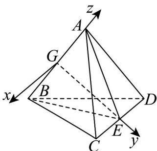

> [!faq]- 《专题04_空间向量的应用高频题型精准突破_五大题型__高效培优期末专项》官方解析
>
> > [!success]- **【答案】** (1)1 (2) $\frac{1}{3}$ 或 3
>
> > [!note]- **【分析】**
> > （1）取 $CD$ 的中点 $E$ ，连接 $AE, BE$ ，易得 $AE \perp CD$ ， $BE \perp CD$ ，根据线面垂直的判定及性质定理得 $CD \perp AB$ ，进而得到答案；
> >
> > (2) 构建合适的空间直角坐标系，设 $\overline{AF} = \lambda \overline{AB}$ ， $0 < \lambda < 1$ ，利用向量法及线面角的正弦值，列方程求参数
> >
> > $\lambda$ ，即可得到 $\frac{|AF|}{|BF|}$ 的值·
>
> > [!note]- **【解析】**
> > （1）如图，取 CD 的中点 E，连接 AE, BE
> >
> > 因为 $AC = AD = BC = BD$ ，所以 $AE\perp CD$ ， $BE\perp CD$
> >
> > 因为 AE I BE = E ， AE ， BE ⊂ 平面 ABE ，
> >
> > 所以 $CD \perp$ 平面 $ABE$ ，又 $AB \subset$ 平面 $ABE$ ，所以 $CD \perp AB$
> >
> > 所以异面直线 $AB$ ， $CD$ 所成角的正弦值为 $\sin 90^{\circ} = 1$
> >
> > (2) 如图，因为 $AC = AD = BC = BD$ ，易知 $\triangle ACD \cong \triangle BCD$ ，则 $AE = BE$
> >
> > 
> >
> > 取 AB 的中点 G ，连接 GE ，易知 $GE \perp AB$ ，又 $CD \perp$ 平面 ABE ，易知 CD, GE, AB 两两垂直，
> >
> > 以 G 为坐标原点，分别以 GE, GA 所在直线为 y 轴，z 轴，过点 G 作 CD 的平行线为 x 轴，建立如图所示的空间直角坐标系．
> >
> > 由题设，易得 $AE = 2\sqrt{2}$ ， $GE = 2$ ，则 $A(0,0,2)$ ， $B(0,0,-2)$ ， $C(2,2,0)$ ， $D(-2,2,0)$
> >
> > 则 $AB = (0,0, - 4)$ ， $DC = (4,0,0)$ ，设 $AF = \lambda AB = (0,0, - 4\lambda)$ ， $0 <   \lambda <  1$
> >
> > 则 $F(0,0,2-4\lambda)$ ，故 $\overline{FC} = (2,2,4\lambda - 2)$ ，
> >
> > 设平面 $\underset{FCD}{的法向量为} n = (x, y, z)$ ，则 $\left\{\begin{aligned}&n \cdot DC = 4x = 0\\&n \cdot FC = 2x + 2y + (4\lambda - 2)z = 0\end{aligned}\right.$
> >
> > 令 $z = -1$ ，则 $n = (0,2\lambda -1, - 1)$ ，设直线 $AF$ 与平面 $FCD$ 所成角为 $\theta$
> >
> > $$
> > \sin \theta = \left| \cos A F, n \right| = \frac {\left| A F \cdot n \right|}{\left| A F \right| | n |} = \frac {4 \lambda}{4 \lambda \cdot \sqrt {(2 \lambda - 1) ^ {2} + 1}} = \frac {2 \sqrt {5}}{5}
> > $$
> >
> > 解得 $\lambda=\frac{1}{4}$ 或 $\lambda=\frac{3}{4}$ ，
> >
> > 所以使得直线 $_{AF}$ 与平面 $_{FCD}$ 所成角的正弦值为 $\frac{2\sqrt{5}}{5}$ ，
> >
> > 则点 $F$ 位于棱 $AB$ 上靠近点 $A$ 或点 $B$ 的四等分点处，
> >
> > 所以 $\frac{|AF|}{|BF|}=\frac{1}{3}$ 或 $_{3}$ .
