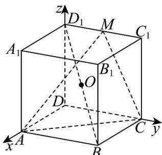

> [!faq]- 《专题04_空间向量的应用高频题型精准突破_五大题型__高效培优期末专项》官方解析
>
> > [!success]- **【答案】** B
>
> > [!note]- **【分析】**
> > 建立空间直角坐标系，求解平面法向量，即可利用点面距离公式求解 $O$ 到平面AMC的距离，进而根据球的性质求解即可半径即可·
>
> > [!note]- **【解析】**
> > 球心 O 为正方体中心，半径 R=1 ，以 D 为原点， $\overline{DA},\overline{DC},\overline{DD}_{1}$ 分别为 x,y,z 轴建立空间直角坐标系，如图，
> >
> > $$
> > A (2, 0, 0), C (0, 2, 0), M (0, 1, 2), O (1, 1, 1)
> > $$
> >
> > 则 $AC = (-2, 2, 0)$ , $AM = (-2, 1, 2)$ , $AO = (-1, 1, 1)$ ,
> >
> > 
> >
> > 设平面 ACM 的一个法向量为 $n = (x, y, z)$ ，
> >
> > $\left\{ \begin{array}{l} AC \cdot n = 0 \\ AM \cdot n = 0 \end{array} \right. \Rightarrow \left\{ \begin{array}{l} -2x + 2y = 0 \\ -2x + y + 2z = 0 \end{array} \right.$ ，令 $x = 2$ ，则 $y = 2, z = 1$
> >
> > 所以 $n=(2,2,1)$ ，则 O 到平面 AMC 的距离为： $d=\frac{|AO-n|}{|n|}=\frac{|-2+2+1|}{3}=\frac{1}{3}$
> >
> > 截面圆半径 $r^2 = R^2 - d^2 = 1 - \frac{1}{9} = \frac{8}{9}$ ，所以截面面积 $S = \pi r^2 = \frac{8\pi}{9}$
> >
> > 故选 **B**.
