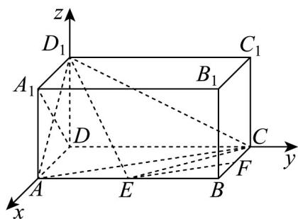

> [!faq]- 《专题04_空间向量的应用高频题型精准突破_五大题型__高效培优期末专项》官方解析
>
> > [!success]- **【答案】** (1)证明见解析(2) $\frac{1}{3}$ (3)2
>
> > [!note]- **【分析】**
> > 如图建立空间直角坐标系·（1）由 $DA_{1}\cdot D_{1}E=0$ 可完成证明；
> >
> > (2) 直线 EF 到平面 $ACD_{1}$ 的距离即为点 E 到平面 $ACD_{1}$ 的距离，由题可得平面 $ACD_{1}$ 的法向量，则点 E 到平面 $ACD_{1}$ 的距离为 $d = \frac{|D_{1}E \cdot n|}{|n|}$ ;
> >
> > (3) 由题可得平面 $D_{1}EC$ 与平面 $ECD$ 法向量，据此可得平面 $D_{1}EC$ 与平面 $ECD$ 所成的角余弦值关于 $m$ 的表达式，然后可得答案：
>
> > [!note]- **【解析】**
> > （1）以 $D$ 为坐标原点， $\overline{DA}$ ， $\overline{DC}$ ， $\overline{DD_1}$ 分别为 $x, y, z$ 轴的正方向，以 1 为单位长度建立空间直角坐标系如图，设 $AE = m$ ，
> >
> > 则 $A(1,0,0)$ ， $C(0,2,0)$ ， $A_{1}(1,0,1)$ ， $D_{1}(0,0,1)$ ， $E(1,m,0)$
> >
> > 证明：因为 $\overline{DA}_{1}=(1,0,1)$ ， $\overline{D}_{1}E=(1,m,-1)$ ，所以 $\overline{DA}_{1}\cdot\overline{D}_{1}E=1\times1+0\times m+1\times(-1)=0$ ，
> >
> > 所以 $\overline{DA_{1}}\perp\overline{D_{1}E}$ ，所以 $D_{1}E\perp A_{1}D$ ；
> >
> > (2) 因为 E 为 AB 的中点，点 F 是棱 BC 的中点，
> >
> > 所以 $EF \parallel AC$ ，则易得 $EF \parallel$ 平面 $ACD_{1}$ ，
> >
> > 所以直线 EF 到平面 $ACD_{1}$ 的距离即为点 E 到平面 $ACD_{1}$ 的距离，
> >
> > 又 $E(1,1,0)$ ，从而 $\overline{D_1E} = (1,1, - 1)$ ， $\overline{AC} = (-1,2,0)$ ， $\overline{AD_1} = (-1,0,1)$
> >
> > 设平面 $ACD_{1}$ 的法向量为 $n = (x, y, z)$ ，则
> >
> > $\left\{ \begin{array}{l} n \cdot AC = 0, \\ \rightarrow \square \square \square \\ n \cdot AD_{1} = 0, \end{array} \right.$ 即 $\left\{ \begin{array}{l} -x + 2y = 0, \\ -x + z = 0, \end{array} \right.$ 所以 $\left\{ \begin{array}{l} x = 2y, \\ x = z, \end{array} \right.$ 令 $y = 1$ ，从而 $n = (2,1,2)$
> >
> > 所以点 E 到平面 $ACD_{1}$ 的距离为 $d=\frac{\left|\overrightarrow{D_{1}E}\cdot\boldsymbol{n}\right|}{\left|\boldsymbol{n}\right|}=\frac{\left|2+1-2\right|}{3}=\frac{1}{3}$ .
> >
> > （3）设平面 $D_{1}EC$ 法向量为 $u = (x_{1},y_{1},z_{1})$ ，因为 $\stackrel {\mathrm{uuuu}}{D_1C} = (0,2, - 1)$ ， $\stackrel {\mathrm{uuuu}}{CE} = (1,m - 2,0)$ ，由 $\left\{ \begin{array}{ll}u\cdot D,C = 0\\ \rightarrow \\ u\cdot CE = 0 \end{array} \right.$ ，即
> >
> > $\left\{ \begin{array}{l} 2y_{1} - z_{1} = 0, \\ x_{1} + (m - 2)y_{1} = 0, \end{array} \right.$ 所以 $\left\{ \begin{array}{l} z_{1} = 2y_{1} \\ x_{1} = (2 - m)y_{1} \end{array} \right.$
> >
> > 令 $y_{1} = 1$ ，从而 $\pmb {u} = (2 - m,1,2)$
> >
> > 平面 ECD 的法向量为 $DD_{1} = (0, 0, 1)$
> >
> > 设平面 $D_{1}EC$ 与平面 ECD 所成的角为 $\theta$ ，
> >
> > 依题意有 $\cos\theta=\frac{\left|\boldsymbol{u}\cdot\overrightarrow{DD}\right|}{\left|\boldsymbol{u}\right|\left|DD_{1}\right|}=\frac{2}{\sqrt{(m-2)^{2}+5}}$
> >
> > 所以当 m=2 时， $\cos\theta$ 取最大值，此时，角 $\theta$ 取到最小值，
> >
> > 
> >
> > 即 AE = 2 时，平面 $D_{1}EC$ 与平面 ECD 所成的角最小.
