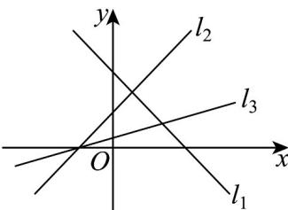

<!-- question-source:start -->
7. 如图，直线 $l_{1}$ ， $l_{2}$ ， $l_{3}$ 的斜率分别为 $k_{1}$ ， $k_{2}$ ， $k_{3}$ ，倾斜角分别为 $\alpha_{1}$ ， $\alpha_{2}$ ， $\alpha_{3}$ ，则下列选项正确的是（）

A. $k_{1} < k_{3} < k_{2}$ B. $k_{3} < k_{2} < k_{1}$ C. $\alpha_{1} < \alpha_{3} < \alpha_{2}$ D. $\alpha_{3} < \alpha_{2} < \alpha_{1}$
<!-- question-source:end -->

![[高中/课堂同步/题库/人教A版高中数学同步讲义(2026)/04_选择性必修第二册/期末/专项训练/专题05_直线的倾斜角与斜率高频题型精准突破_六大题型__高效培优期末/_compact/answers/Q00060658A1.md]]
