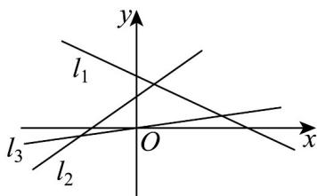

<!-- question-source:start -->
8. 如图，若直线 $l_{1}$ ， $l_{2}$ ， $l_{3}$ 的斜率分别为 $k_{1}$ ， $k_{2}$ ， $k_{3}$ ，则（）

A. $k_{3} < k_{2} < k_{1}$ B. $k_{3} < k_{1} < k_{2}$ C. $k_{1} < k_{2} < k_{3}$ D. $k_{1} < k_{3} < k_{2}$
<!-- question-source:end -->

![[高中/课堂同步/题库/人教A版高中数学同步讲义(2026)/04_选择性必修第二册/期末/专项训练/专题05_直线的倾斜角与斜率高频题型精准突破_六大题型__高效培优期末/_compact/answers/Q00060659A1.md]]
